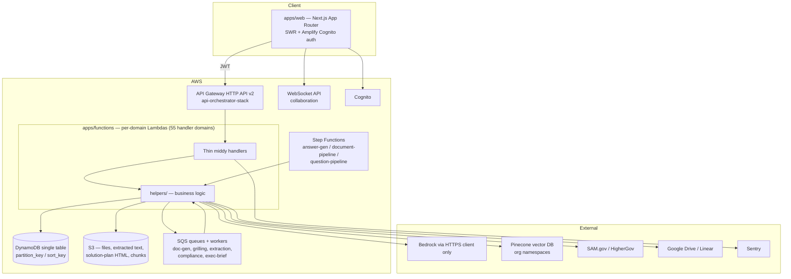
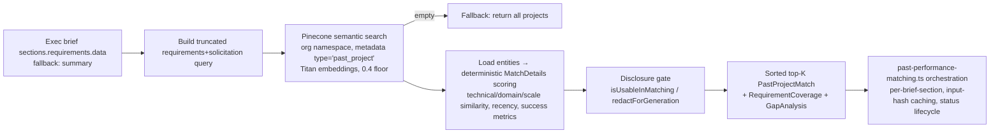
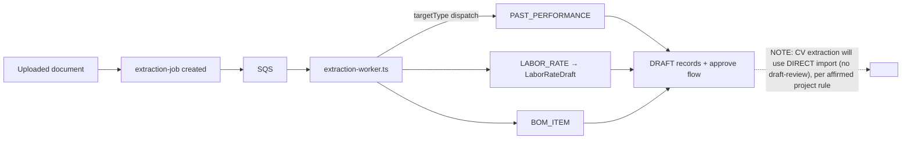

# Architecture — AutoRFP

## System Overview

AutoRFP is a **serverless, single-tenant-table, multi-tenant SaaS** on AWS, organized as a pnpm monorepo with four deployable/shared packages. The architectural style is **serverless microservice-per-domain behind one HTTP API**: ~50 route files each become a per-domain Lambda stack registered in a single API Gateway HTTP API (v2) orchestrator. Long-running AI work is pushed off the request path onto **SQS-driven workers** and **Step Functions pipelines**.


<!-- Text fallback: Next.js web app authenticates via Cognito and calls API Gateway HTTP API v2 with JWT. The API fans out to per-domain thin middy Lambda handlers (apps/functions), which delegate to helpers/ for business logic. Helpers read/write a single DynamoDB table, S3, SQS queues, and Pinecone. SQS workers and three Step Functions pipelines run async AI work. All Bedrock calls go through an HTTPS client (never the SDK). External integrations: SAM.gov, HigherGov, Google Drive, Linear, Sentry. A separate WebSocket API handles real-time collaboration. -->

## Key Patterns & Decisions

- **Thin handler pattern**: parse event → destructured `safeParse` (Zod) → call helper → `apiResponse()`. Middy stack `authContextMiddleware → orgMembershipMiddleware → requirePermission('<domain>:<action>') → httpErrorMiddleware`; all REST handlers wrapped `withSentryLambda`. `orgId` always from body/query/path, never JWT.
- **Single-table DynamoDB**: `PK_NAME='partition_key'` / `SK_NAME='sort_key'` from `packages/core/src/constants.ts`; SK pattern `{orgId}#{projectId}#{entityId}`; all access via `helpers/db.ts` (`createItem`, `queryBySkPrefix`, `queryByIndex`, …).
- **Contract-first types**: every domain type is a Zod schema in `packages/core` with `z.infer<>`; the 5-type entity pattern (CreateRequest/UpdateRequest/Item/DBItem/ListItem) is the target convention (older files still violate it — see code-quality-assessment.md).
- **Bedrock only via HTTP** (`bedrock-http-client.ts`, API key from SSM) — never `@aws-sdk/client-bedrock-runtime`.
- **Route registration invariant**: each `<domain>.routes.ts` is registered in two index-aligned arrays (`allDomains[]`, `domainStackNames[]`) in `api-orchestrator-stack.ts`; a length mismatch throws at synth.
- **Big blobs off DynamoDB**: solution-plan HTML and document chunks live in S3; DynamoDB items store keys/metadata plus small structured fields (e.g. `costSchedule` on the solution plan — the precedent for attaching server-validated structured data alongside the HTML body).
- **Feature gating**: solution-plan feature gated on org flag `enableSolutionPlan`; most AI document generation is solution-plan-gated (must be READY unless the type is in `SOLUTION_PLAN_GATE_EXEMPT_DOCUMENT_TYPES`).

## Interaction Diagrams

### RFP document generation pipeline (incl. TEAM_QUALIFICATIONS failure mode)

```mermaid
sequenceDiagram
    participant U as User (web)
    participant API as POST /rfp-document/generate
    participant DDB as DynamoDB
    participant Q as SQS
    participant W as generate-document-worker
    participant CTX as document-context / document-tools
    participant BR as Bedrock (HTTP)
    U->>API: generate(type=TEAM_QUALIFICATIONS)
    API->>API: solution-plan gate check (must be READY)
    API->>DDB: create placeholder doc, status=GENERATING
    API->>Q: enqueue job
    Q->>W: job
    W->>CTX: gatherAllContext (budgeted; TEAM_QUALIFICATIONS maximizes KB personnel/certs @12k chars)
    W->>BR: prompt (document-prompts.ts) + tools (document-tools.ts)
    BR-->>W: HTML content
    W->>W: validateGeneratedContent (rejects empty / placeholder / < min length)
    alt valid
        W->>DDB: status=READY, store content
    else invalid — retry up to 3x (30/60/120s backoff)
        W->>BR: retry
        W->>DDB: status=FAILED + user notification when exhausted
    end
    Note over CTX,BR: No personnel entity exists → KB has no real bios unless résumés were uploaded.<br/>Hypothesis: model fabricates or emits thin content → validation rejects → FAILED.
```
<!-- Text fallback: User calls POST /rfp-document/generate. The handler enforces the solution-plan gate, writes a placeholder document with status GENERATING, and enqueues an SQS job. The worker gathers budgeted context (for TEAM_QUALIFICATIONS the KB budget is maximized at 12,000 chars for personnel/certs), builds prompts and tools, and calls Bedrock over HTTP. validateGeneratedContent rejects empty/placeholder/too-short HTML; up to 3 retries with 30/60/120s backoff, then FAILED plus user notification. Because no personnel entity exists, TEAM_QUALIFICATIONS has no grounded data — hypothesized cause of fabrication or validation-rejected thin output. -->

### Solution-plan grilling loop

```mermaid
sequenceDiagram
    participant U as User (web)
    participant API as POST /solution-plan/init
    participant Q as SQS
    participant W as solution-plan-worker
    participant G as Griller (Tech Lead agent)
    participant S as Synthesizer
    participant S3 as S3
    U->>API: init(orgId, projectId, oppId)
    API->>Q: enqueue, status=GRILLING
    Q->>W: job
    loop grilling rounds
        W->>G: exec-brief sections (SOLUTION_PLAN_BRIEF_SECTIONS; scoring excluded)
        G-->>W: probing Q&A transcript (coverage incl. area 4: TEAM COMPOSITION — roles, headcount, allocation %, onshore/offshore)
    end
    W->>S: transcript → synthesize (status=GENERATING_SOT)
    S-->>W: single HTML plan (~10k chars, h2 sections) + structured costSchedule (server-recomputed totals)
    W->>S3: store HTML (contentKey)
    W->>API: DynamoDB item: metadata, version++, status=READY (or FAILED); isStale orthogonal
    U->>U: SolutionPlanPanel / TipTap editor (PATCH /update bumps version)
```
<!-- Text fallback: POST /solution-plan/init enqueues an SQS job (status GRILLING). The worker runs a two-agent loop: the Griller interrogates against executive-brief sections (summary, deadlines, requirements, contacts, risks, pricing, pastPerformance — scoring excluded), with mandatory coverage area 4 "TEAM COMPOSITION" (roles/headcount/allocation/onshore-offshore as free prose). The Synthesizer (status GENERATING_SOT) produces one HTML blob stored in S3 plus a structured, nullable costSchedule field with server-recomputed totals on the DynamoDB item; status becomes READY or FAILED, version is monotonic, isStale is orthogonal. Frontend renders via SolutionPlanPanel and a full-page TipTap editor. -->

### Past-performance matching engine


<!-- Text fallback: Requirements come from the exec brief (sections.requirements.data, falling back to summary). A truncated query is embedded and searched in Pinecone within the org namespace filtered by metadata type 'past_project' (Titan embeddings, 0.4 score floor); if empty, all projects are returned as fallback. Each hit is loaded and scored deterministically (technical/domain/scale similarity, recency, success metrics), passed through a disclosure gate (isUsableInMatching/redactForGeneration), and returned as sorted top-K matches with coverage and gap analysis. past-performance-matching.ts orchestrates per exec-brief section with input-hash caching. This is the pattern the initiative intends to re-point at people. -->

### AI extraction worker (structured records from documents)


<!-- Text fallback: An extraction job for an uploaded document is enqueued to SQS; extraction-worker.ts dispatches on targetType (PAST_PERFORMANCE, LABOR_RATE, BOM_ITEM) and produces DRAFT records with a draft-action approve flow (LaborRateDraftSchema exists). This is the established "AI extracts structured records from a document" pattern; the affirmed project rule says the planned CV extraction will bypass the draft-review step and import directly. -->

## Data Flow Summary

1. **Ingest**: files → S3 → document-pipeline Step Function → text extraction → chunking → Pinecone indexing (`indexStatus: pending → TEXT_EXTRACTED → CHUNKED → INDEXED`), chunks reloadable from S3.
2. **Understand**: question-pipeline extracts questions; exec-brief queue builds section briefs; solution-plan worker synthesizes strategy.
3. **Generate**: answer-generation Step Function and document-generation worker retrieve context (Pinecone + DynamoDB + S3 chunks) and call Bedrock over HTTP.
4. **Deliver**: generated content in DynamoDB/S3, surfaced through SWR-driven Next.js UI; collaboration events over WebSocket.

## Improvement Opportunities (observed)

- No personnel domain — the initiative's core gap (see business-overview.md).
- God-files in the generation path (`document-prompts.ts` 1,407 lines; `generate-document-worker.ts` helper 1,527 lines) — the exact area the initiative touches.
- Older UI (pricing under `components/`) and older handlers (`create-rfp-document.ts`) diverge from current conventions; `features/solution-plan/` is the exemplar to copy.
- Stale compiled output committed in `packages/infra/lib/` shadows real sources.
