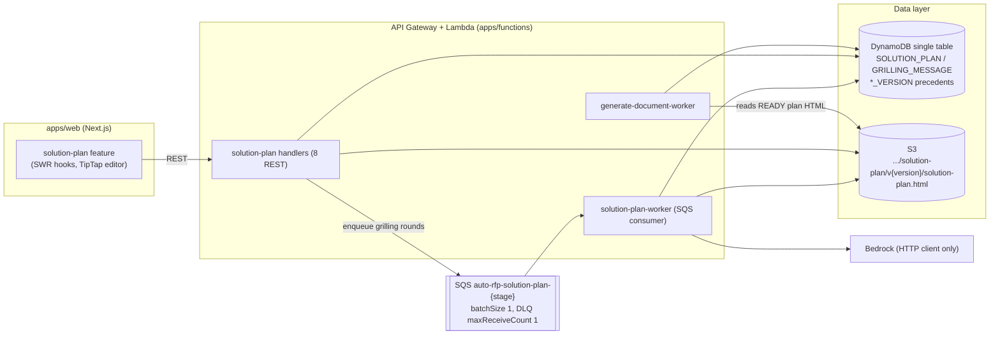
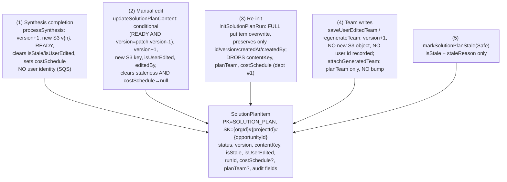
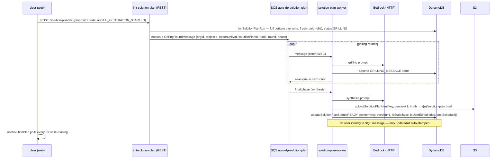
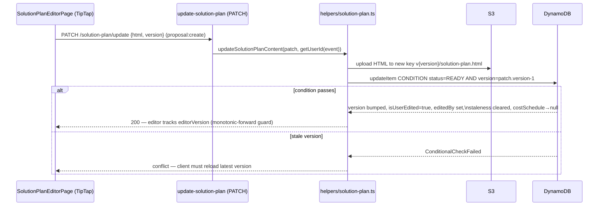
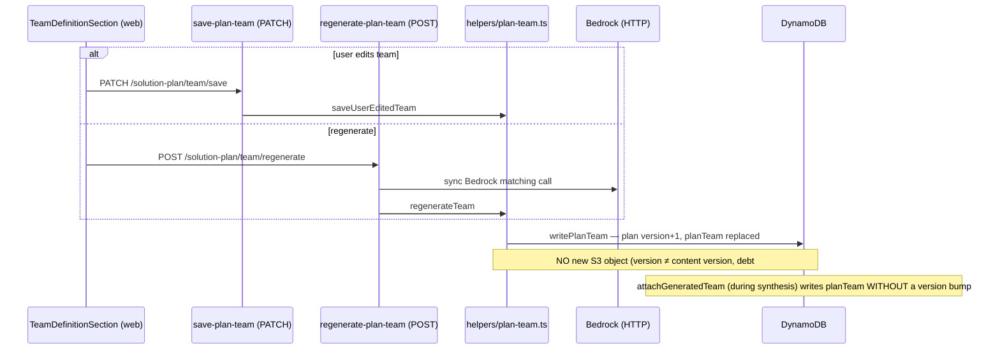

# Architecture — AutoRFP (Solution-Plan Versioning Blast Radius)

> Scope: this document is grounded in the focused scan for intent `260821-solution-plan-versioning`. Areas outside the solution-plan blast radius are shown only as boundary boxes.

## System Overview

AutoRFP is a serverless AWS system in a pnpm-workspaces monorepo:

- **apps/web** — Next.js App Router frontend (SWR polling, TipTap editor for the plan)
- **apps/functions** — AWS Lambda handlers (Node 20, ESM), thin handlers per domain + `helpers/` owning all business logic
- **packages/core** — shared Zod schema library (built first; both web and functions import it)
- **packages/infra** — AWS CDK; API Gateway routes per domain (`api/routes/*.routes.ts` registered in `api-orchestrator-stack.ts`), SQS queues, Lambda bundling via `lambdaEntry()` NodejsFunction

Persistence is a **single DynamoDB table** (PK constants + SK builder functions) plus **S3** for large content (plan HTML is never in DynamoDB — only a `contentKey` pointer). AI calls go to **Bedrock exclusively via an HTTP client** (`bedrock-http-client.ts`, SSM-cached API key) — never the Bedrock SDK.


<!-- Text fallback: Web solution-plan feature calls 8 REST handlers via API Gateway. Handlers read/write the DynamoDB single table and S3, and enqueue grilling rounds to the SQS queue auto-rfp-solution-plan-{stage} (batchSize 1, DLQ maxReceiveCount 1). The solution-plan-worker Lambda consumes the queue, calls Bedrock via the HTTP client, writes transcript messages and plan state to DynamoDB, and uploads versioned plan HTML to S3. generate-document-worker reads the READY plan's HTML from S3 and plan metadata from DynamoDB. -->

## Key Architectural Patterns

- **Thin handler / fat helper**: handlers parse event → destructured Zod `safeParse` → call helper → `apiResponse()`. All logic in `apps/functions/src/helpers/`.
- **Middy stack**: `authContextMiddleware → orgMembershipMiddleware → requirePermission → httpErrorMiddleware`; `auditMiddleware` added on `init-solution-plan` (AI_GENERATION_STARTED); every REST handler wrapped in `withSentryLambda`.
- **Single-table DynamoDB**: PK constants, SK builders (never manual strings), primitives in `helpers/db.ts` (`createItem`, `putItem`, SET-only `updateItem` with condition expressions, `queryBySkPrefix`/`queryAllBySkPrefix`, `batchDeleteItems`, `deleteAllBySkPrefix`, retry/backoff).
- **Content-in-S3, pointer-in-DynamoDB**: plan HTML lives at `{orgId}/{projectId}/{opportunityId}/solution-plan/v{version}/solution-plan.html` (ADR-7); the plan item stores `contentKey` only. Old versions are **already retained** in S3.
- **Async via plain SQS worker** (NOT a Step Function, unlike the answer/document/question pipelines): grilling rounds re-enqueue themselves; final phase runs synthesis.
- **Optimistic concurrency** on manual edits: conditional write `status = READY AND version = patch.version - 1`.
- **Monotonic plan version** (ADR-11): never reset, bumped by synthesis, manual edit, team save, team regenerate — but NOT by `attachGeneratedTeam`, and re-init preserves it while overwriting everything else.

## Solution-Plan Data Model & Write Hooks


<!-- Text fallback: The SolutionPlanItem (one per opportunity, PK SOLUTION_PLAN, SK orgId#projectId#opportunityId) has five write hook points: (1) synthesis completion bumps version, uploads new S3 v{n} HTML, sets READY, no user identity; (2) manual edit uses an optimistic-concurrency conditional write, bumps version, new S3 key, sets isUserEdited/editedBy, clears staleness and nulls costSchedule; (3) re-init does a full putItem overwrite preserving only id/version/createdAt/createdBy and drops contentKey, planTeam, and costSchedule; (4) team save/regenerate bump version with no new S3 object and no user id, while attachGeneratedTeam writes planTeam without a bump; (5) markSolutionPlanStale sets isStale/staleReason only. -->

Transcript storage: `PK='GRILLING_MESSAGE'`, `SK={solutionPlanId}#{round:3pad}#{ts}#{messageId}`, read with `queryAllBySkPrefix`.

## Interaction Diagrams

### 1. Grilling → Synthesis (SQS worker)


<!-- Text fallback: The user POSTs /solution-plan/init; the handler overwrites the plan item with a fresh runId and status GRILLING, then enqueues a GrillingRoundMessage. The worker consumes rounds one at a time, calls Bedrock via HTTP, appends GRILLING_MESSAGE transcript items, and re-enqueues the next round. On the final phase it runs synthesis, uploads versioned HTML to S3, and updates the plan to READY with the new contentKey, incremented version, cleared staleness/user-edit flags, and costSchedule. The SQS message carries no user identity. The UI polls useSolutionPlan every 3 seconds while running. -->

### 2. Manual Plan Edit (optimistic concurrency)


<!-- Text fallback: The TipTap editor PATCHes /solution-plan/update with the HTML and the version it edited. The helper uploads the HTML to a new S3 key, then performs a conditional DynamoDB update requiring status READY and version equal to patch.version minus 1. On success the version is bumped, isUserEdited and editedBy are set, staleness is cleared, and costSchedule is nulled; the editor tracks editorVersion with a monotonic-forward guard. On a stale version the conditional check fails and the client must reload. -->

### 3. Team Save / Regenerate


<!-- Text fallback: A user team edit goes through PATCH /solution-plan/team/save to saveUserEditedTeam; regenerate goes through POST /solution-plan/team/regenerate, which makes a synchronous Bedrock matching call, then regenerateTeam. Both funnel into writePlanTeam, which bumps the plan version and replaces planTeam — without creating a new S3 object and without recording a user id. attachGeneratedTeam, used during synthesis, writes planTeam without bumping the version. -->

### 4. Document Generation Reading the Approved Plan

```mermaid
sequenceDiagram
  participant G as generate-document-worker
  participant GT as solution-plan-gate
  participant D as DynamoDB
  participant S as S3
  participant V as rfp-document-version helper

  G->>GT: gate check — plan status must be READY
  G->>D: load plan item (contentKey, version, costSchedule, planTeam)
  G->>S: loadApprovedSolutionPlanContext — fetch contentKey HTML
  G->>G: strip HTML→text, inject as SoT into prompts;\ncostSchedule → buildPricingRulesBlock / renderCostScheduleBlock;\nplanTeam.members → team-qualifications-context (UNFILLED→DELETED→FILLED)
  G->>D: write generated document stamped solutionPlanId + solutionPlanVersion
  G->>V: createVersion — RFP_DOCUMENT_VERSION item (6-pad versionNumber, KEEP_COUNT pruning)
```
<!-- Text fallback: generate-document-worker checks the solution-plan gate (status READY), loads the plan item from DynamoDB, fetches the contentKey HTML from S3 via loadApprovedSolutionPlanContext, strips it to text and injects it as source-of-truth into document prompts; costSchedule feeds the pricing prompt blocks and planTeam.members feeds team-qualifications context assembly with UNFILLED→DELETED→FILLED classification. The generated document is stamped with solutionPlanId and solutionPlanVersion, and a version record is created via the rfp-document-version helper with a 6-padded versionNumber and KEEP_COUNT pruning. document-context.ts does NOT read the plan. -->

## Version-History Precedent (Copy Target)

Three existing entities already implement user-facing version history with the same shape:

- `RFP_DOCUMENT_VERSION_PK`, SK `={projectId}#{opportunityId}#{documentId}#{versionNumber:6pad}` (`helpers/rfp-document-version.ts`)
- `QUESTIONNAIRE_VERSION_PK` and `REQUIRED_FORM_VERSION_PK`, same pattern, `KEEP_COUNT = 30` retention
- Version record fields: `versionId`, `versionNumber`, `htmlContentKey`, `title`, `wordCount`, `changeNote` (≤500), `createdBy`, `createdByName`, `createdAt`
- Endpoints: list versions, compare, revert, cherry-pick (in `rfp-document.routes.ts`)
- Caveat: the precedent schemas use legacy `CreateVersionDTOSchema`/`RevertVersionDTOSchema` names — new entities must use the 5-type `<Entity>CreateRequest` pattern.

## Key Design Decisions (as found in code, ADR-referenced inline)

| Decision | Evidence | Implication for versioning |
|---|---|---|
| Plan HTML in S3, versioned path, retained | `buildSolutionPlanHtmlKey`, ADR-7 | Historical content already exists for synthesis/edit versions — version records can point at existing keys |
| Monotonic version, never reset | ADR-11, re-init preserves `version` | Safe as a version-record key component |
| planTeam embedded in plan item | ADR-002 (team-definition intent) | Team state is only capturable via plan-item snapshots — team bumps have no S3 artifact |
| Grilling via plain SQS worker, not Step Functions | `api-orchestrator-stack.ts` lines 212–819 | Synthesis write has no user identity; audit relies on init's auditMiddleware |
| Optimistic concurrency on content edits only | `updateSolutionPlanContent` | Team writes and re-init bypass the version guard |

## Improvement Opportunities (architecture-level)

1. Re-init is a lossy full overwrite (drops `planTeam`, `costSchedule`, `contentKey`) — versioning should snapshot BEFORE re-init.
2. `version` conflates content and metadata changes (team-only bumps have no S3 object) — a version-record entity must record what changed, not assume an HTML artifact per bump.
3. Attribution gaps: synthesis (SQS, no identity) and team writes (no user id) cannot populate `createdBy`/`createdByName` on version records without plumbing identity through.
4. `queryBySkPrefix` does not paginate — acceptable at ≤30 versions if the KEEP_COUNT pruning convention is copied.
