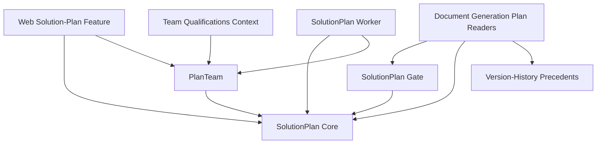

# Component Inventory — Solution-Plan Versioning Blast Radius

> Components identified in the focused scan for intent `260821-solution-plan-versioning`. Components outside this radius (answer generation, KB pipelines, SAM.gov, pricing/staffing beyond `costSchedule`, auth internals) are not inventoried here.

## Component Catalogue

### SolutionPlan Core

- **Responsibility**: owns the `SolutionPlanItem` (one per opportunity), its lifecycle (`GRILLING → GENERATING_SOT → READY | FAILED`), monotonic version counter (ADR-11), staleness flags, S3 HTML content pointer, and manual-edit optimistic concurrency.
- **Code**: `packages/core/src/schemas/solution-plan.ts` (5-type schemas + grilling messages + response schemas), `apps/functions/src/constants/solution-plan.ts`, `apps/functions/src/helpers/solution-plan.ts` (SK builders, CRUD, S3 HTML via `buildSolutionPlanHtmlKey`, staleness `markSolutionPlanStale(Safe)`), `helpers/solution-plan-init.ts`, REST handlers `init/get/update/get-html-content/get-transcript`.
- **Depends on**: DB primitives (`helpers/db.ts`), S3, SQS enqueue (init), middleware stack.
- **Depended on by**: PlanTeam, SolutionPlan Worker, SolutionPlan Gate, Document Generation Plan Readers, Team Qualifications Context, Web Solution-Plan Feature.
- **Note**: re-init (`initSolutionPlanRun`) is a lossy full overwrite — preserves only `id`, `version`, `createdAt`, `createdBy`; drops `contentKey`, `planTeam`, `costSchedule`.

### PlanTeam

- **Responsibility**: the recommended/edited project team embedded in the plan item (ADR-002); member lines have exactly three shapes (FILLED / DELETED-employee / UNFILLED); user edits and regeneration.
- **Code**: `apps/functions/src/helpers/plan-team.ts` (`writePlanTeam`, `saveUserEditedTeam`, `regenerateTeam`, `attachGeneratedTeam`), handlers `get-plan-team.ts`, `save-plan-team.ts`, `regenerate-plan-team.ts`.
- **Depends on**: SolutionPlan Core (embedded storage), Bedrock HTTP client (regenerate matching).
- **Note**: save/regenerate bump the plan version with NO new S3 object and NO user id; `attachGeneratedTeam` (synthesis path) writes `planTeam` WITHOUT a version bump.

### SolutionPlan Worker

- **Responsibility**: asynchronous grilling loop + synthesis. Consumes `GrillingRoundMessage` from SQS (`auto-rfp-solution-plan-{stage}`, batchSize 1, DLQ maxReceiveCount 1), appends transcript items, re-enqueues rounds, and on the final phase runs `processSynthesis` (bump version, upload versioned S3 HTML, set READY, write `costSchedule`, clear staleness/user-edit flags).
- **Code**: `apps/functions/src/helpers/solution-plan-worker.ts` (synthesis at lines 337–418), `handlers/solution-plan/solution-plan-worker.ts`; infra wiring in `api-orchestrator-stack.ts` lines 212–819.
- **Depends on**: SolutionPlan Core, Bedrock HTTP client, SQS, S3, DynamoDB.
- **Note**: message carries NO user identity — synthesis writes are unattributed beyond `updatedAt`.

### Document Generation Plan Readers

- **Responsibility**: consume the READY plan as source-of-truth during document generation: `loadApprovedSolutionPlanContext` (`generate-document-worker.ts` lines 939–973) loads and strips the plan HTML; version stamping of generated documents (`solutionPlanId` + `solutionPlanVersion`, worker lines 1534–1536, `rfp-document.ts:348`); `costSchedule` feeds `buildPricingRulesBlock` / `renderCostScheduleBlock`.
- **Code**: `apps/functions/src/helpers/generate-document-worker.ts` (plan-injection section scanned deeply; rest of the worker skimmed), `document-prompts.ts` / `document-tools.ts` (skimmed — entry points of `solutionPlanText`/`hasSolutionPlan`/`costSchedule`), `handlers/rfp-document/generate-document.ts` and `edit-section.ts` (grep-level).
- **Depends on**: SolutionPlan Core (read), SolutionPlan Gate, S3, Version-History Precedents (`createVersion` at worker line 1556).
- **Note**: `document-context.ts` does NOT read the plan.

### Team Qualifications Context

- **Responsibility**: assembles TEAM_QUALIFICATIONS generation context from `plan.planTeam.members`, classifying lines in fixed order UNFILLED → DELETED → FILLED, with defensive degrade (a FILLED line whose Employee lookup misses becomes DELETED with a data-integrity warning — generation never fails on a stale reference).
- **Code**: `apps/functions/src/helpers/team-qualifications-context.ts` (assembly section scanned).
- **Depends on**: SolutionPlan Core / PlanTeam (read), employee lookups (outside this scan's deep coverage).

### SolutionPlan Gate

- **Responsibility**: read-only status gate — document generation and section editing require a READY plan.
- **Code**: `apps/functions/src/helpers/solution-plan-gate.ts`; web counterpart `features/solution-plan/lib/gating.ts` + `useSolutionPlanGate.ts` (skimmed).
- **Depends on**: SolutionPlan Core (read).

### Version-History Precedents

- **Responsibility**: existing user-facing version-history implementations to copy for plan versioning: `RFPDocumentVersion` (list/compare/revert/cherry-pick), `QuestionnaireVersion`, `RequiredFormVersion`; 6-pad `versionNumber` SK, `KEEP_COUNT = 30` pruning, `changeNote` ≤500, `createdBy`/`createdByName` attribution.
- **Code**: `packages/core/src/schemas/rfp-document-version.ts`, `apps/functions/src/helpers/rfp-document-version.ts`, `handlers/rfp-document/` version handlers (revert head read; others grep-level), routes in `rfp-document.routes.ts`.
- **Depends on**: DB primitives, S3 (`htmlContentKey`).
- **Note**: carries legacy `CreateVersionDTOSchema`/`RevertVersionDTOSchema` names — do not replicate.

### Web Solution-Plan Feature

- **Responsibility**: the entire plan UX — polling status (`useSolutionPlan`, 3s while running), HTML fetch (`useSolutionPlanHtmlContent`), TipTap editing with `editorVersion` monotonic-forward guard (`SolutionPlanEditorPage.tsx`), plan panel with "Version {plan.version}" display + stale banner + `TeamDefinitionSection` (`SolutionPlanPanel.tsx`), team view/edit tables, init/regenerate actions.
- **Code**: `apps/web/features/solution-plan/` — deep: `hooks/useSolutionPlan.ts`, `hooks/useUpdateSolutionPlan.ts`, `lib/swr.ts`, `components/SolutionPlanEditorPage.tsx` (top half + version tracking); skimmed: remaining hooks/components (`useSolutionPlanActions.ts`, `SolutionPlanPanel.tsx`, team hooks).
- **Depends on**: Solution-plan REST API, SWR + `authenticatedFetcher`, Shadcn UI.

## Dependency Overview

<!-- Text fallback: The Web Solution-Plan Feature depends on SolutionPlan Core and PlanTeam. PlanTeam is embedded in SolutionPlan Core. The SolutionPlan Worker writes to SolutionPlan Core and attaches the generated PlanTeam. SolutionPlan Gate reads SolutionPlan Core. Document Generation Plan Readers depend on the gate, read SolutionPlan Core, and write into the Version-History Precedents (rfp-document createVersion). Team Qualifications Context reads PlanTeam. -->
