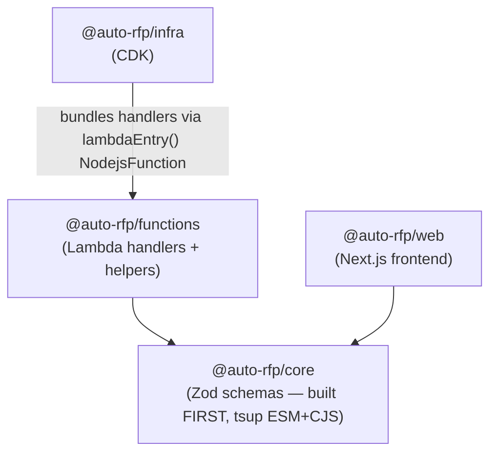

# Dependencies — AutoRFP

> From the focused scan (intent `260821-solution-plan-versioning`). Full dependency trees of unscanned packages were not audited.

## Internal Cross-Package Dependencies

<!-- Text fallback: @auto-rfp/functions and @auto-rfp/web both import @auto-rfp/core, which must be built first (tsup, ESM+CJS). @auto-rfp/infra bundles the functions handlers at deploy time via lambdaEntry() NodejsFunction — a build-time dependency on apps/functions source. -->

- **Build order**: `packages/core` first; rebuild it after any schema change before typechecking/testing dependents.
- `apps/functions/src/constants/common.ts` re-exports `PK_NAME`/`SK_NAME` from `@auto-rfp/core` (`packages/core/src/constants.ts` is the single source of truth) so backend code imports them from `@/constants/common`.
- Path alias `@/*` → `src/*` in apps/functions; `@/*` in apps/web.

## External Dependencies (scanned area)

| Dependency | Consumer | Role |
|---|---|---|
| zod ^3.24/3.25 | core (re-exported types everywhere) | Schema validation + type inference |
| @middy/core ^7 | functions | Handler middleware stack |
| AWS SDK v3 (DynamoDB, S3, SQS clients) | functions `helpers/db.ts` and domain helpers only — never raw SDK in handlers | Persistence, queue |
| Sentry Lambda SDK | functions | `withSentryLambda` on every REST handler |
| ulid / uuid | functions | runId / entity ids |
| next 16.0.10, react ^18.3, swr ^2.3.3 | web | Frontend framework + server state |
| TipTap | web | Plan HTML editor |
| aws-amplify | web | Cognito auth + `authenticatedFetcher` JWT attach |
| aws-cdk-lib ^2.230–2.237 | infra | Stacks, routes, SQS queue/DLQ, Lambda bundling |
| Bedrock (external service via HTTPS) | functions `bedrock-http-client.ts` | AI invocations — HTTP only, SSM-cached API key; `@aws-sdk/client-bedrock-runtime` is deliberately NOT a dependency of handler code |

## Dependency Rules Observed

1. Handlers never import AWS SDK clients directly — all persistence flows through `helpers/db.ts` or domain helpers.
2. Bedrock is reachable only through the HTTP client — an architectural firewall, not just a convention.
3. Domain types are never redefined locally — web and functions import from `@auto-rfp/core` (legacy `apps/functions/src/types/` DBItem aliases are being migrated into core `<Entity>DBItemSchema`s).
4. Infra references handler source paths via `lambdaEntry('domain/handler.ts')`, so renaming/moving a handler file is an infra-visible change.
