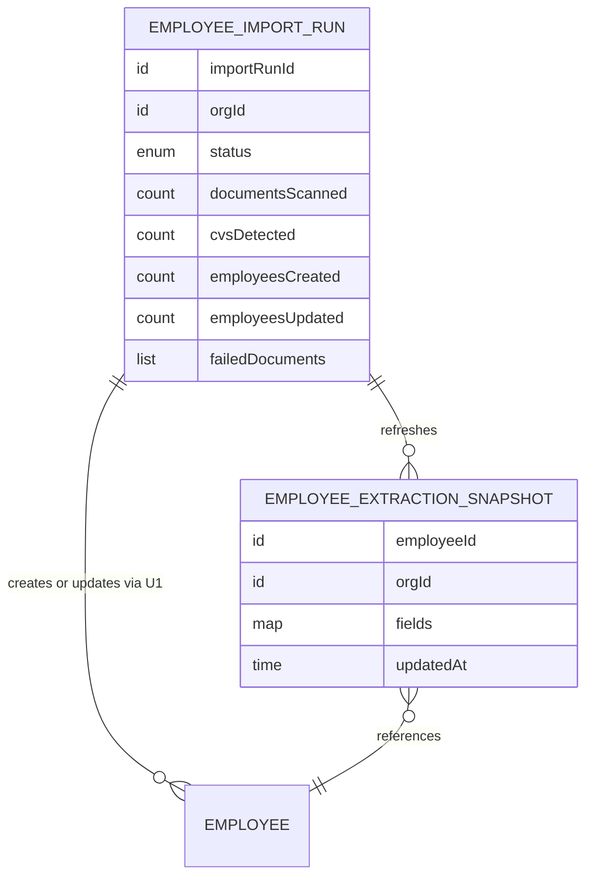

# Functional Specification — cv-import (U2)

Behavioural source of truth for U2: the import workflow and run lifecycle. Grounded in unit-of-work.md (U2), unit-of-work-story-map.md (FR2.x), requirements.md, components.md, and the confirmed answers (Q1, Q2). ER view derived from `entities.md`; rules summary derived from `rules.md`.

## Workflow W1 — Generate employee list from CVs

1. A manager triggers Generate-from-CVs on the Team page; permission (BR1.2) and single-run (BR1.1) checks pass.
2. An EmployeeImportRun is created with status RUNNING; execution moves off the request path (BR5.1); the page shows progress.
3. **Detection**: every org document with extracted text is classified CV / non-CV; documents without extracted text are recorded UNREADABLE; a failed classification call retries once, then records EXTRACTION_FAILED; five consecutive EXTRACTION_FAILED records end the run as an AI-service outage (BR2.1 → BR4.2). Counters advance as documents are processed.
4. **Extraction**: each detected CV yields a candidate (name, roles, certifications, resume reference = the source document, location where stated); a failed extraction call follows the same retry/EXTRACTION_FAILED handling; a candidate without a name records INCOMPLETE_EXTRACTION (BR2.2).
5. **Merge**: each candidate merges by normalized name — one match updates, none creates, several record AMBIGUOUS_NAME without writing (BR3.1) — through U1's persistence rules (BR3.4); field precedence compares current values against the U2-owned EmployeeExtractionSnapshot so manual edits win (BR3.3); nothing is ever deleted (BR3.2).
6. **Completion**: the run closes COMPLETED or COMPLETED_WITH_ERRORS with counts and the named failure list (BR4.1); the Team page shows the summary banner and the refreshed table.

Unhappy paths: an unrecoverable error mid-run → FAILED with partial counts, imported rows preserved (BR4.2); a second trigger while RUNNING → refused with guidance (BR1.1).

## Workflow W2 — Review import outcome

1. The completion banner names counts and, when present, the failed documents by name and category (Q2).
2. The manager corrects imported records through U1's normal editing (this is the designed cleanup path for direct import); manual corrections are then protected from future re-imports (BR3.3).

## State Machine — EmployeeImportRun

| Current state | Event | Guard | Next state | Actions |
|---------------|-------|-------|------------|---------|
| (none) | Trigger | BR1.1, BR1.2 | RUNNING | create run, start async execution |
| RUNNING | All documents processed, no failures | — | COMPLETED | set counts, completedAt |
| RUNNING | All documents processed, failures recorded | — | COMPLETED_WITH_ERRORS | set counts + failure list |
| RUNNING | Unrecoverable error | — | FAILED | preserve imports, set partial counts |

All three completion states are terminal; a new trigger creates a new run.

## Derived View — Entity Relationships

<!-- Text fallback: EmployeeImportRun records one execution: status, counts, and a failure list with four reason categories. It creates or updates Employees through U1's persistence rules and refreshes one EmployeeExtractionSnapshot per touched employee. The snapshot (owned by this unit) references the Employee and holds the last extracted field values used for manual-edits-win precedence. U1's Employee schema is not modified. -->

## Derived View — Rules Summary

Run lifecycle: BR1.1 single run, BR1.2 permission. Detection/extraction: BR2.1 categorization + AI-failure handling, BR2.2 name requirement. Merge: BR3.1 by normalized name with ambiguity refusal, BR3.2 never delete, BR3.3 manual-edits-win via snapshot, BR3.4 through U1. Reporting: BR4.1 named failures, BR4.2 partial-failure preservation. Execution: BR5.1 async with progress. Full text: `rules.md`.
