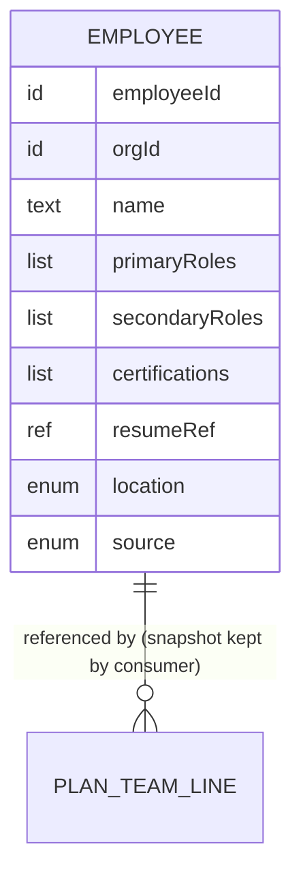

# Functional Specification — employee-pool (U1)

Behavioural source of truth for U1: the ordered workflows and state transitions. Grounded in unit-of-work.md (U1), unit-of-work-story-map.md (FR1.x, FR5.1), requirements.md, components.md, and the confirmed answers (Q1, Q2). The ER diagram is derived from `entities.md` (its YAML is the source of truth); the rules summary is derived from `rules.md`.

## Workflow W1 — Browse and find employees

1. An org member opens the Team page.
2. The system verifies read permission (BR2.1) and org scope (BR2.3).
3. The list renders per BR4.1 (search/filter/sort/pagination) with BR4.2 states.
4. Selecting a row opens the employee's edit view (managers) or a read view of the same fields (members without manage permission see no mutating actions).

Unhappy paths: permission refused → authorization error, nothing rendered; request failure → error state with retry (BR4.2).

## Workflow W2 — Create an employee

1. A manager opens the create view from the Team page.
2. The manager fills name, roles (primary/secondary, suggestions per BR1.5), certifications, resume/bio reference, location.
3. Submission validates BR1.1–BR1.4; failures return field-level errors with entered data preserved (BR4.3).
4. On success the record persists with `source: MANUAL`, timestamps set (BR3.2), and the list reflects it.

## Workflow W3 — Edit an employee

1. A manager opens an employee's edit view; current values are pre-filled.
2. Changes submit through the same validation (BR1.1–BR1.4, BR4.3).
3. Identity is immutable (BR3.2); `updatedAt` advances; `source` is unchanged by edits.

## Workflow W4 — Delete an employee

1. A manager triggers delete from the list or edit view; a confirmation states what will happen, including that saved solution-plan teams keep a snapshot of the person (BR3.1).
2. On confirmation the record is removed from the pool.
3. Consumers holding references resolve display from their stored snapshot and mark the line as referencing a removed employee (the marking is the plan-team unit's behavior; this unit only guarantees the delete is never blocked by references).

## State Machine — Employee lifecycle

| Current state | Event | Guard | Next state | Actions |
|---------------|-------|-------|------------|---------|
| (none) | Create (manual) | BR1.x pass; BR2.2 | Active | persist with source MANUAL |
| (none) | Create (import) | import flow (U2) | Active | persist with source AI_IMPORT |
| Active | Edit | BR1.x pass; BR2.2 | Active | update fields, advance updatedAt |
| Active | Delete | BR2.2; confirmation | Removed | remove record; consumers use snapshots (BR3.1) |

`Removed` is terminal; there is no soft-delete or restore in this release.

## Derived View — Entity Relationships

<!-- Text fallback: One entity, Employee, with identifier employeeId, org scoping via orgId, name, primary/secondary role lists, certifications, an optional resume reference, an onshore/offshore location, and a MANUAL/AI_IMPORT source marker. Plan-team lines (owned by the plan-team unit) reference employees; consumers keep a display snapshot for removed employees. Labor-rate positions feed role suggestions only — no stored relationship. -->

## Derived View — Rules Summary

Validation: BR1.1 name, BR1.2 roles, BR1.3 location, BR1.4 resumeRef, BR1.5 suggestions-with-free-text. Authorization/scoping: BR2.1 member read, BR2.2 admin manage, BR2.3 org scope. Lifecycle: BR3.1 delete-with-snapshot, BR3.2 provenance + immutable identity. Presentation: BR4.1 list semantics, BR4.2 five states, BR4.3 field-level errors. Full text: `rules.md`.
