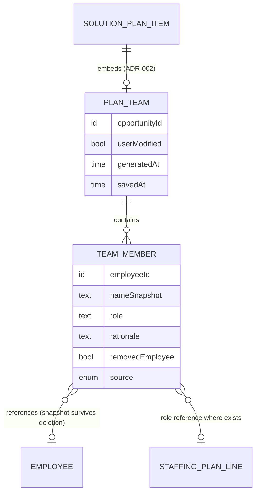

# Functional Specification — plan-team (U3)

Behavioural source of truth for U3: the team lifecycle workflows and state machine. Grounded in unit-of-work.md (U3), unit-of-work-story-map.md (FR3.x, FR5.2), requirements.md, components.md (ADR-002/003/005), and the confirmed answers (Q1, Q2). ER view derived from `entities.md`; rules summary derived from `rules.md`.

## Workflow W1 — Team proposed during plan generation

1. Plan synthesis completes its strategy content; the team step runs (BR1.1, ADR-005: synthesis calls matching and writes its own item).
2. Matching loads the org's full pool via U1 (BR5.2), sizes slots per the staffing plan or derives them from requirements (BR1.3), scores candidates, and writes rationale sentences (BR1.4).
3. IF the prior team was user-modified THEN it is preserved untouched (BR1.2) and the fresh recommendation is discarded; ELSE the proposed team is attached with `generatedAt`, `userModified: false`.
4. Empty pool → the section carries the prerequisite state instead (BR4.1); matching failure → error state with retry, plan still READY (BR4.2).

## Workflow W2 — View the team in the solution plan

1. The Team Definition section renders the persisted PlanTeam: person (name snapshot), role, rationale per line.
2. Lines whose employee was deleted render from snapshots with the removed-employee mark (BR3.3).
3. Unfilled positions (no matching candidate) render as open slots with no rationale (BR1.3).

## Workflow W3 — Modify and save the team

1. An editor with solution-plan permissions (BR5.1) toggles in-place edit mode.
2. Edits: swap a person (picker over U1's pool), change a role (staffing positions suggested; free text allowed, BR2.1), remove a line, add a person (`source: MANUAL`, no rationale).
3. Save persists the team, sets `userModified` and `savedAt` (BR3.1); Cancel restores the last persisted team.
4. The saved team is what documents read from now on (BR3.2), and it survives plan regenerations (BR1.2).

## Workflow W4 — Explicit team regenerate

1. The editor triggers Regenerate team; a confirmation warns that the current (possibly modified) team will be replaced.
2. Matching reruns as in W1 steps 2; the fresh recommendation replaces the team, `userModified` resets to false (BR1.2).
3. Failure leaves the existing team untouched and shows the retry error (BR4.2).

## State Machine — PlanTeam

| Current state | Event | Guard | Next state | Actions |
|---------------|-------|-------|------------|---------|
| Absent | Plan generation | pool non-empty (BR1.1) | Proposed | attach team, set generatedAt |
| Absent | Plan generation | pool empty (BR4.1) | Absent | prerequisite state shown |
| Proposed | Plan regeneration | userModified false | Proposed | fresh recommendation replaces |
| Proposed | Save after edits | BR5.1 | UserModified | persist, set userModified + savedAt |
| UserModified | Plan regeneration | BR1.2 | UserModified | preserved untouched |
| Proposed or UserModified | Explicit regenerate | BR5.1; confirmation | Proposed | replace, reset userModified |
| any | Referenced employee deleted | — | same | line marked removedEmployee (BR3.3) |

## Derived View — Entity Relationships

<!-- Text fallback: The solution plan item embeds at most one PlanTeam, which contains TeamMember lines. Each line optionally references an Employee (with a name snapshot that survives deletion) and optionally a staffing plan position for its role. PlanTeam tracks userModified, generatedAt, savedAt; members carry role, rationale, removed-employee mark, and an AI/manual source. -->

## Derived View — Rules Summary

Generation: BR1.1 auto-propose, BR1.2 preservation/explicit-regenerate, BR1.3 sizing, BR1.4 rationale. Linkage: BR2.1 staffing position refs. Persistence: BR3.1 save/cancel, BR3.2 saved team is the source, BR3.3 removed-employee snapshots. Resilience: BR4.1 empty pool, BR4.2 failure + retry + manual assembly. Authorization/matching: BR5.1 plan permissions, BR5.2 full-pool matching. Full text: `rules.md`.
