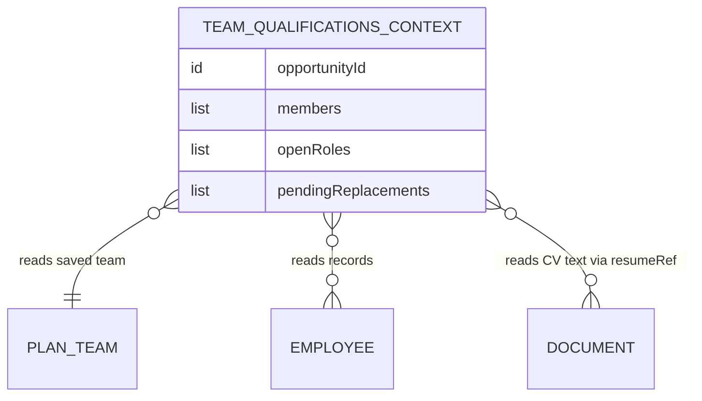

# Functional Specification — team-qualifications (U4)

Behavioural source of truth for U4: the generation workflow. Grounded in unit-of-work.md (U4), unit-of-work-story-map.md (FR4.x), requirements.md, components.md, and the confirmed answers (Q1, Q2). ER view derived from `entities.md`; rules summary derived from `rules.md`.

## Workflow W1 — Generate the team qualification document

1. A user triggers TEAM_QUALIFICATIONS generation from the solution plan's Team Definition section.
2. Preconditions: existing pipeline checks stand (BR1.2); additionally, a saved team with at least one member must exist — otherwise the request is refused with guidance to review and save the team first, and no generation run is created (BR1.1).
3. Context assembly: each team line is classified by the detection order in BR2.5 (no employeeId and no nameSnapshot → UNFILLED; removedEmployee → DELETED; employeeId → FILLED, with a stale-reference fallback to DELETED when the Employee lookup finds nothing). The TeamQualificationsContext is then built — filled members with structured fields plus resolvable CV text (BR2.2), open roles for unfilled positions, snapshot-only pending-replacement entries for removed employees (BR2.3). No generic knowledge-base personnel search (BR2.1).
4. Generation runs through the existing pipeline (prompting, validation, retries); the no-invention rule stands (BR2.4).
5. On success the document lands among the plan's documents and is viewable from the Team Definition section (BR3.1).

Unhappy paths: no saved team → guidance, not failure (BR1.1); generation/validation failure → the pipeline's existing retry-then-FAILED behavior with user notification (unchanged); a member's CV text unresolvable → structured fields cited alone with the missing bio source noted (BR2.2); a FILLED line whose Employee no longer exists → treated as DELETED with a data-integrity warning, never a fatal error (BR2.5).

## State Machine

U4 introduces no new lifecycle — the generated document follows the existing document pipeline's states (GENERATING → READY | FAILED). The one behavioral change is at admission: the no-saved-team case exits BEFORE a document run is created, so it never reaches GENERATING or FAILED (BR1.1).

| Current state | Event | Guard | Next state | Actions |
|---------------|-------|-------|------------|---------|
| (no run) | Generation requested | saved team present (BR1.1); existing gates (BR1.2) | GENERATING | assemble context (BR2.1–BR2.3), enqueue |
| (no run) | Generation requested | no saved team | (no run) | guidance response |
| GENERATING | Valid output | BR2.4 validation | READY | document among plan documents (BR3.1) |
| GENERATING | Invalid output, retries exhausted | existing pipeline | FAILED | existing notification |

## Derived View — Entity Relationships

<!-- Text fallback: The transient TeamQualificationsContext reads the saved PlanTeam (plan-team unit), the referenced Employee records (employee-pool unit), and each member's CV document text via resumeRef (org-documents domain). It carries filled members, open roles, and pending-replacement entries. Nothing is persisted by this unit. -->

## Derived View — Rules Summary

Preconditions: BR1.1 saved-team guard (refuse, don't fail), BR1.2 existing gates unchanged. Grounding: BR2.1 saved team + employees only, BR2.2 structured + CV text, BR2.3 open roles + marked snapshots, BR2.4 no invented personnel, BR2.5 line-shape detection + stale-reference fallback. Output: BR3.1 document among plan documents. Full text: `rules.md`.
