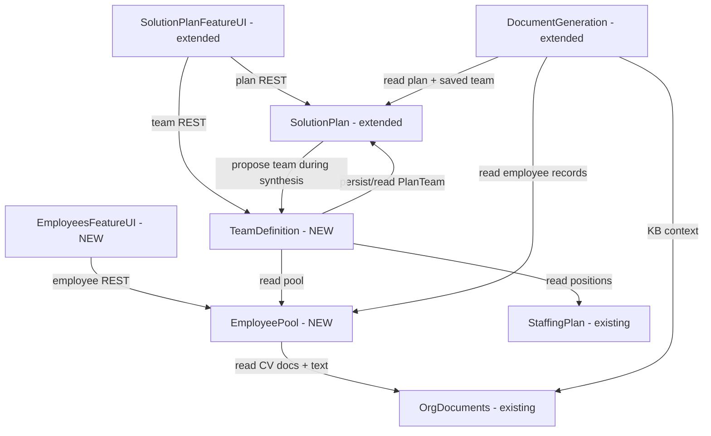

# Component Catalogue — Team Definition

Derived from requirements.md (FR1–FR5), the confirmed answers in `domain-design-questions.md` (Q1–Q5), and the code knowledge base (architecture.md, component-inventory.md). Two components are NEW (EmployeePool, TeamDefinition, plus the new EmployeesFeatureUI frontend module); the rest are EXISTING components this feature extends or reads — declared here so every dependency reference resolves.

## Machine-Readable Catalogue

```yaml
components:
  - name: EmployeePool
    summary: NEW — org-level employee registry with AI CV import (FR1, FR2, FR5.1)
    behaviour: >
      Owns the Employee entity and all rules over it: multi-role records with primary/secondary
      classification; field validation; org scoping on every read/write; permission enforcement
      (admins manage, members view); the AI import flow — scan all org documents, detect CVs,
      extract fields, DIRECT-write employees with merge-by-name (update existing, add new, never
      delete), report unprocessable documents, track import runs.
    responsibilities:
      - Employee CRUD with validation and org scoping
      - AI CV detection and extraction orchestration (direct import, merge-by-name)
      - Import-run tracking and partial-failure reporting
      - Employee permission enforcement (employee:read / employee:manage pattern)
    depends_on:
      - component: OrgDocuments
        interaction: read org documents and their extracted text to detect and extract CVs
        style: sync
    dependents:
      - component: TeamDefinition
        interaction: reads the full employee pool as matching candidates
      - component: DocumentGeneration
        interaction: reads employee records (names, roles, certifications, resume refs) for TEAM_QUALIFICATIONS content
      - component: EmployeesFeatureUI
        interaction: REST consumer for the Team page and create/edit pages
    external_dependencies:
      - name: DynamoDB (single table)
        kind: database
        purpose: employee and import-run persistence via the shared db helpers
      - name: AI model (HTTP client)
        kind: third-party-api
        purpose: CV detection and field extraction
      - name: SQS import queue
        kind: queue
        purpose: async import runs off the request path (NFR6); deployed by reusing the existing extraction worker with a new EMPLOYEE target type (ADR-004)
    entities:
      - name: Employee
        identifier: employeeId
        attributes: [orgId, name, primaryRoles, secondaryRoles, certifications, resumeRef, location, source, createdAt, updatedAt]
      - name: EmployeeImportRun
        identifier: importRunId
        attributes: [orgId, status, documentsProcessed, documentsFailed, failedDocumentNames, startedAt, completedAt]

  - name: TeamDefinition
    summary: NEW — team matching and the saved plan team (FR3, FR5.2)
    behaviour: >
      Owns the PlanTeam entity (persisted as a structured field on the solution plan item, the
      costSchedule precedent). Matches the org's full employee pool — no vector index — against
      the opportunity's staffing plan positions and solicitation requirements, deterministically
      plus with AI, producing a recommended team with per-person match rationale. Preserves a
      user-modified team across plan regenerations; replaces it only on explicit regenerate.
      Save/cancel semantics for the in-place edit mode; the saved team is what documents read.
    responsibilities:
      - Candidate matching (full pool, deterministic + AI scoring, rationale text)
      - PlanTeam persistence rules (userModified flag, preserve-vs-replace policy)
      - Team save / explicit-regenerate REST behavior for the plan's team section
      - Role linkage — staffing plan position where one exists, free-text otherwise
    depends_on:
      - component: EmployeePool
        interaction: load the org's employees as matching candidates and for member details
        style: sync
      - component: StaffingPlan
        interaction: read the opportunity's staffing positions for role linkage
        style: sync
      - component: SolutionPlan
        interaction: read and persist the PlanTeam field on the plan item (save / regenerate)
        style: sync
    dependents:
      - component: SolutionPlan
        interaction: invokes matching during plan synthesis to propose the initial team
      - component: SolutionPlanFeatureUI
        interaction: REST consumer for team display, edit, save, regenerate
    external_dependencies:
      - name: AI model (HTTP client)
        kind: third-party-api
        purpose: match reasoning and rationale generation
    entities:
      - name: PlanTeam
        identifier: opportunityId
        attributes: [members, userModified, generatedAt, savedAt]
        references:
          - entity: Employee
            owned_by: EmployeePool
            relationship: each team member line references one Employee
          - entity: StaffingPlanLine
            owned_by: StaffingPlan
            relationship: a member's role references a staffing plan position where one exists
          - entity: SolutionPlanItem
            owned_by: SolutionPlan
            relationship: PlanTeam is embedded as a structured field on the plan item

  - name: SolutionPlan
    summary: EXISTING (extended) — per-opportunity plan generation and persistence
    behaviour: >
      Existing grilling + synthesis pipeline and plan item persistence (metadata in DynamoDB,
      HTML in S3). Extended: during synthesis it invokes TeamDefinition to propose the team and
      stores the returned PlanTeam field on its item, honoring the preserve-user-modified rule.
    responsibilities:
      - Plan generation pipeline (existing)
      - Plan item persistence including the new PlanTeam field (existing + extended)
    depends_on:
      - component: TeamDefinition
        interaction: propose a recommended team during plan synthesis
        style: sync
    dependents:
      - component: TeamDefinition
        interaction: persists/reads the PlanTeam field on the plan item
      - component: DocumentGeneration
        interaction: reads the plan and its saved team as generation context
      - component: SolutionPlanFeatureUI
        interaction: REST consumer for the plan view/editor
    external_dependencies:
      - name: DynamoDB (single table)
        kind: database
        purpose: plan item persistence
      - name: S3
        kind: object-store
        purpose: plan HTML body
    entities:
      - name: SolutionPlanItem
        identifier: opportunityId
        attributes: [orgId, projectId, status, version, contentKey, costSchedule, planTeam]

  - name: DocumentGeneration
    summary: EXISTING (extended) — AI proposal document generation incl. TEAM_QUALIFICATIONS
    behaviour: >
      Existing SQS-driven generation pipeline (context budgets, prompts, tools, validation,
      retries). Extended: the TEAM_QUALIFICATIONS context builder reads the saved PlanTeam and
      the referenced Employee records so prompts cite real people; with no saved team the request
      is rejected with guidance instead of producing a FAILED run.
    responsibilities:
      - Document generation pipeline (existing)
      - TEAM_QUALIFICATIONS grounding on the approved team (extended)
    depends_on:
      - component: SolutionPlan
        interaction: read the plan and its saved PlanTeam as generation context
        style: sync
      - component: EmployeePool
        interaction: read referenced employees' full records for bios/certifications
        style: sync
      - component: OrgDocuments
        interaction: existing KB retrieval for supplementary context
        style: sync
    dependents: []
    external_dependencies:
      - name: AI model (HTTP client)
        kind: third-party-api
        purpose: document content generation
      - name: SQS generation queue
        kind: queue
        purpose: async generation runs
    entities: []

  - name: OrgDocuments
    summary: EXISTING (unchanged) — org knowledge bases and uploaded documents
    behaviour: >
      Existing document storage, text extraction, and indexing lifecycle. Unchanged by this
      feature; it is the source of CV documents and their extracted text.
    responsibilities:
      - Document storage and extracted-text lifecycle (existing)
    depends_on: []
    dependents:
      - component: EmployeePool
        interaction: CV detection/extraction reads documents and extracted text
      - component: DocumentGeneration
        interaction: existing KB context retrieval
    external_dependencies:
      - name: S3
        kind: object-store
        purpose: files and extracted text
    entities:
      - name: Document
        identifier: documentId
        attributes: [orgId, knowledgeBaseId, fileKey, textFileKey, indexStatus]

  - name: StaffingPlan
    summary: EXISTING (unchanged) — per-opportunity role/position lines with rates
    behaviour: >
      Existing pricing-domain staffing plan (position, hours, rate, phase). Unchanged; read as
      the role source for team lines.
    responsibilities:
      - Staffing plan persistence (existing)
    depends_on: []
    dependents:
      - component: TeamDefinition
        interaction: reads positions for role linkage
    external_dependencies:
      - name: DynamoDB (single table)
        kind: database
        purpose: staffing plan persistence
    entities:
      - name: StaffingPlanLine
        identifier: position
        attributes: [opportunityId, position, hours, rate, phase]

  - name: EmployeesFeatureUI
    summary: NEW — frontend feature module for the org Team page (FR1, FR2 UI)
    behaviour: >
      New feature module: the org-level Team page (table with search/filter/sort/pagination),
      separate create/edit pages, the Generate-from-CVs action with progress and partial-failure
      display, skeleton loading, permission-aware action visibility.
    responsibilities:
      - Team page, create/edit pages, import progress UI
      - Data hooks for employee REST endpoints
    depends_on:
      - component: EmployeePool
        interaction: REST endpoints for employees and import runs
        style: sync
    dependents: []
    external_dependencies: []
    entities: []

  - name: SolutionPlanFeatureUI
    summary: EXISTING (extended) — solution plan frontend feature, gains the Team Definition section
    behaviour: >
      Existing feature module extended with the Team Definition section: view mode (person, role,
      match rationale), in-place edit mode (swap/add/remove, change role), save/cancel, explicit
      regenerate, empty-pool and failure states, and the team qualification document actions.
    responsibilities:
      - Team Definition section UI within the plan view (extended)
      - Existing plan panel/editor (existing)
    depends_on:
      - component: SolutionPlan
        interaction: existing plan REST endpoints
        style: sync
      - component: TeamDefinition
        interaction: team save / regenerate REST endpoints
        style: sync
    dependents: []
    external_dependencies: []
    entities: []
```

## Component Diagram


<!-- Text fallback: EmployeesFeatureUI calls EmployeePool over REST. SolutionPlanFeatureUI calls SolutionPlan (plan REST) and TeamDefinition (team REST). EmployeePool reads CV documents and extracted text from OrgDocuments. TeamDefinition reads the employee pool from EmployeePool, staffing positions from StaffingPlan, and persists/reads the PlanTeam field via SolutionPlan. SolutionPlan invokes TeamDefinition during synthesis to propose the team (deliberate two-way interaction, see ADR-005). DocumentGeneration reads the plan and saved team from SolutionPlan, employee records from EmployeePool, and KB context from OrgDocuments. -->

## Component Summary

| Component | Purpose | Depends On | Dependents | Entities Owned |
|---|---|---|---|---|
| EmployeePool (NEW) | Employee registry + AI CV import | OrgDocuments | TeamDefinition, DocumentGeneration, EmployeesFeatureUI | Employee, EmployeeImportRun |
| TeamDefinition (NEW) | Team matching + saved plan team | EmployeePool, StaffingPlan, SolutionPlan | SolutionPlan, SolutionPlanFeatureUI | PlanTeam |
| SolutionPlan (extended) | Plan generation + persistence | TeamDefinition | TeamDefinition, DocumentGeneration, SolutionPlanFeatureUI | SolutionPlanItem |
| DocumentGeneration (extended) | AI document generation | SolutionPlan, EmployeePool, OrgDocuments | — | — |
| OrgDocuments (existing) | Org documents + extracted text | — | EmployeePool, DocumentGeneration | Document |
| StaffingPlan (existing) | Role/position lines with rates | — | TeamDefinition | StaffingPlanLine |
| EmployeesFeatureUI (NEW) | Org Team page frontend | EmployeePool | — | — |
| SolutionPlanFeatureUI (extended) | Plan frontend incl. team section | SolutionPlan, TeamDefinition | — | — |

## Entity Ownership

| Entity | Owning Component | Identifier | Attributes | References |
|---|---|---|---|---|
| Employee | EmployeePool | employeeId | orgId, name, primaryRoles, secondaryRoles, certifications, resumeRef, location, source, createdAt, updatedAt | — |
| EmployeeImportRun | EmployeePool | importRunId | orgId, status, documentsProcessed, documentsFailed, failedDocumentNames, startedAt, completedAt | — |
| PlanTeam | TeamDefinition | opportunityId | members, userModified, generatedAt, savedAt | Employee (EmployeePool), StaffingPlanLine (StaffingPlan), SolutionPlanItem (SolutionPlan) |
| SolutionPlanItem | SolutionPlan | opportunityId | orgId, projectId, status, version, contentKey, costSchedule, planTeam | — |
| Document | OrgDocuments | documentId | orgId, knowledgeBaseId, fileKey, textFileKey, indexStatus | — |
| StaffingPlanLine | StaffingPlan | position | opportunityId, position, hours, rate, phase | — |

## External Dependencies

| Component | Dependency | Kind | Purpose |
|---|---|---|---|
| EmployeePool | DynamoDB (single table) | database | employee + import-run persistence |
| EmployeePool | AI model (HTTP client) | third-party-api | CV detection and extraction |
| EmployeePool | SQS import queue | queue | async import runs (reuses extraction worker deployment, ADR-004) |
| TeamDefinition | AI model (HTTP client) | third-party-api | match reasoning and rationale |
| SolutionPlan | DynamoDB, S3 | database, object-store | plan persistence (existing) |
| DocumentGeneration | AI model (HTTP client), SQS | third-party-api, queue | generation pipeline (existing) |
| OrgDocuments | S3 | object-store | files + extracted text (existing) |
| StaffingPlan | DynamoDB (single table) | database | staffing persistence (existing) |

## Rationale

| Component | Why a separate building block |
|---|---|
| EmployeePool | Distinct data ownership (Employee) and change rate — reference data maintained by admins, independent of any opportunity (Q1: A) |
| TeamDefinition | Distinct concern — matching logic and team lifecycle change with the solution plan, not with pool maintenance (Q1: A). Alternatives Rejected: a three-way split (extraction as its own block) added a boundary through the middle of one flow; a single "personnel" block coupled org-level reference data to per-opportunity plan logic |
| SolutionPlan / DocumentGeneration / OrgDocuments / StaffingPlan | Existing components — declared for dependency resolution; only SolutionPlan and DocumentGeneration change |
| EmployeesFeatureUI / SolutionPlanFeatureUI | Frontend modules mirror the backend split per the app's feature-per-domain layout (Q5: A) |

**Deliberate dependency cycle**: SolutionPlan ↔ TeamDefinition. Plan synthesis proposes a team (SolutionPlan → TeamDefinition), while team save/regenerate persists onto the plan item (TeamDefinition → SolutionPlan). This is inherent to Q2: A (team embedded in the plan item) and is a command/response pair, not layering confusion — see ADR-005.

## Review

**Verdict:** READY
**Reviewer:** aidlc-architecture-reviewer-agent
**Date:** 2026-08-19T10:25:37Z
**Iteration:** 1

### Findings

| # | Severity | Location | Finding | Recommendation |
|---|---|---|---|---|
| — | — | — | No blocking issues found | Proceed to gate |

### Validation Results

| Check | Result | Evidence |
|---|---|---|
| YAML well-formedness | PASS | 8 components, 6 entities, all unique names; no self-deps; depends_on/dependents symmetric; every entity has exactly one owner + identifier; all references resolve; deliberate cycle (SolutionPlan ↔ TeamDefinition) called out in Rationale + ADR-005 |
| Cross-reference integrity | PASS | Every component/entity named in depends_on, dependents, owned_by, and references exists in the catalogue; no orphaned references |
| Human-readable view consistency | PASS | Component Diagram, Component Summary, Entity Ownership, External Dependencies, and Rationale tables all match the YAML source of truth |
| Infrastructure as external_dependencies | PASS | DynamoDB, S3, SQS, AI model correctly listed as external_dependencies, not as components |
| Entity capture depth | PASS | All entities captured at ownership + shape level (identifier + attribute names) with no data types, validation constraints, or cardinality — correct per stage definition |
| Traceability completeness | PASS | All 21 FRs from requirements.md covered with status "OK"; all targets (components/entities) exist in components.md |
| ADR completeness | PASS | All 5 ADRs include Context, Decision, Consequences, Alternatives Rejected, and Security/compliance — satisfies Inception phase guardrail |
| Faithfulness to Q&A | PASS | Q1 (two components: EmployeePool + TeamDefinition), Q2 (PlanTeam as structured field on plan), Q3 (no vector index), Q4 (extraction worker with EMPLOYEE target), Q5 (EmployeesFeatureUI + extended SolutionPlanFeatureUI) — all confirmed answers implemented as designed |
| Codebase claims | PASS | SolutionPlan with costSchedule precedent, DocumentGeneration with TEAM_QUALIFICATIONS failure mode, OrgDocuments, StaffingPlan, and extraction worker pattern all verified against architecture.md + component-inventory.md |
| Project rules adherence | PASS | Team embedded in plan (not separate), direct CV import, merge-by-name, auto-generation with preserved user edits, plan-team modification — all project.md corrections honored |

### Architectural Soundness

**Component boundaries**: The two-new-component split (EmployeePool owns Employee + import; TeamDefinition owns PlanTeam + matching) is justified in ADR-001 with clear change drivers — reference data maintenance vs. per-opportunity plan logic. The rejected alternatives (three-way split, single personnel block) are documented with trade-off reasoning. ✓

**Deliberate cycle justification**: The SolutionPlan ↔ TeamDefinition interaction is explicitly addressed in ADR-005 with full context (FR3.1 auto-generation + Q2 embedded persistence), decision rationale (each component keeps its own responsibility without a third mediator), consequences (components version together, flagged for functional design scrutiny), and rejected alternatives (folding into SolutionPlan bloats it; event-mediation adds async complexity for an in-process step). This is a command/response pair inherent to the chosen storage pattern, not accidental coupling. ✓

**Implementability**: The design extends four existing components (SolutionPlan, DocumentGeneration, OrgDocuments, StaffingPlan) whose shapes are confirmed in the code knowledge base. The new components (EmployeePool, TeamDefinition) follow established patterns — CRUD with AI worker for EmployeePool mirrors the existing extraction-job flow; matching for TeamDefinition mirrors the past-performance engine's deterministic scoring pattern. The costSchedule precedent (structured field on the plan item) is the exact pattern PlanTeam reuses. No unstated dependencies or hidden assumptions found. ✓

**Security & compliance**: All five ADRs address security/compliance implications per the Inception phase guardrail — employee data confined to one component with auditable access (ADR-001), team data inheriting plan item's org scoping (ADR-002), personal data never leaving DynamoDB for the vector store (ADR-003), worker writes validated through EmployeePool rules (ADR-004), no trust boundary changes from the cycle (ADR-005). ✓

**NFR alignment**: NFR6 (async execution) is satisfied — CV extraction uses SQS (EmployeePool.external_dependencies), team matching runs during the already-async solution-plan generation (SolutionPlan invokes TeamDefinition within the solution-plan-worker pipeline per architecture.md). The exact queue/worker deployment (separate queue vs. solution-plan queue reuse) is deferred to Units Generation as intended by the stage definition ("does NOT decide deployment topology"). ✓

**Blast radius**: EmployeePool failure blocks TeamDefinition matching and DocumentGeneration personnel citations — clear single-entity dependency. TeamDefinition failure leaves solution plans without teams and TEAM_QUALIFICATIONS unable to generate — expected impact of the new capability. The SolutionPlan ↔ TeamDefinition cycle means they version together (called out in ADR-005 Consequences). All failure modes are transparent and contained. ✓

### Summary

The domain design is **architecturally sound and implementation-ready**. The YAML catalogue satisfies every well-formedness rule: unique component names, all cross-references resolve, no component depends on itself, depends_on/dependents are symmetric, every entity has exactly one owner with an identifier, all entity references resolve to declared owners, and the dependency graph is acyclic except for one deliberate, justified cycle (SolutionPlan ↔ TeamDefinition, documented in ADR-005 and called out in the Rationale). Infrastructure is correctly modeled as external_dependencies, not components.

All five ADRs meet the Inception phase requirement: Context, Decision, Consequences, and Alternatives Rejected are present for every significant design choice, and security/compliance implications are explicitly addressed. Traceability is complete — all 21 functional requirements from requirements.md are covered with valid targets that exist in the component catalogue.

The design is faithful to every confirmed Q&A answer: two new components per Q1:A, PlanTeam as a structured field on the plan item per Q2:A, full-pool matching without a vector index per Q3:A, extraction worker extension with EMPLOYEE target per Q4:A, and frontend split into EmployeesFeatureUI + extended SolutionPlanFeatureUI per Q5:A. Every claim about the existing codebase (SolutionPlan, costSchedule, DocumentGeneration, StaffingPlan, extraction workers, OrgDocuments) is verified against the code knowledge base. Every affirmed project rule is honored (team embedded in plan, direct import, merge-by-name, auto-generation with preservation, plan-team modification).

The component boundaries are well-justified, the deliberate cycle is architecturally necessary (inherent to the chosen embedded-persistence pattern) and thoroughly documented, and the design is implementable against the real codebase without hidden dependencies or unstated assumptions. Security boundaries are clear, failure modes are transparent, and NFR alignment (async execution) is achieved through existing infrastructure.

A developer could build this system from these artifacts without architectural guidance beyond this document. **Recommend approval to proceed.**
