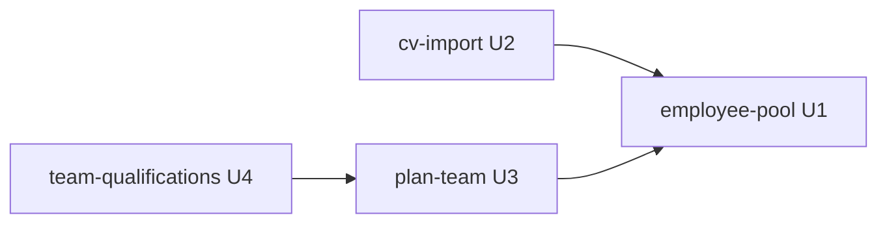

# Unit Dependency DAG — Team Definition

Topology only — what can depend on what. Derived from the component catalogue (`../domain-design/components.md`), the decision records (`../domain-design/decisions.md`), requirements.md, and the confirmed answers (Q3, Q4). Sequencing through this DAG is a later decision, not made here.

## Dependency Graph

```yaml
units:
  - name: employee-pool
    kind: service
    depends_on: []
  - name: cv-import
    kind: service
    depends_on: [employee-pool]
  - name: plan-team
    kind: service
    depends_on: [employee-pool]
  - name: team-qualifications
    kind: service
    depends_on: [plan-team]
```


<!-- Text fallback: cv-import and plan-team both depend on employee-pool; team-qualifications depends on plan-team. employee-pool has no dependencies. Arrows read "depends on". -->

## Integration Points

| Boundary | Surface | Mechanism |
|----------|---------|-----------|
| cv-import → employee-pool | Employee writes (merge-by-name) | U1's persistence helpers only — no direct table access (Q4: A) |
| plan-team → employee-pool | Employee reads (candidates + member details) | U1's read helpers |
| plan-team → solution plan (existing) | PlanTeam field persistence + synthesis hook | plan item field, per ADR-002/ADR-005 |
| team-qualifications → plan-team | Saved PlanTeam read | plan item field |
| team-qualifications → employee-pool | Employee record reads for bios/certifications | U1's read helpers |

No new events, queues-between-units, or shared tables beyond these surfaces (Q4: A). The SQS reuse inside cv-import (extraction worker EMPLOYEE target) is internal to that unit's deployment, not an inter-unit surface.

## Parallel Development Opportunities

- **cv-import (U2) ∥ plan-team (U3)** — no dependency between them; both may proceed once employee-pool (U1) provides the Employee entity and helpers (Q3: A).
- team-qualifications (U4) is unblocked by plan-team (U3) alone; it does not wait on cv-import (U2).
- Multiple valid topological orderings exist: e.g., U1→U2→U3→U4, U1→U3→U2→U4, or U1→(U2∥U3)→U4.
