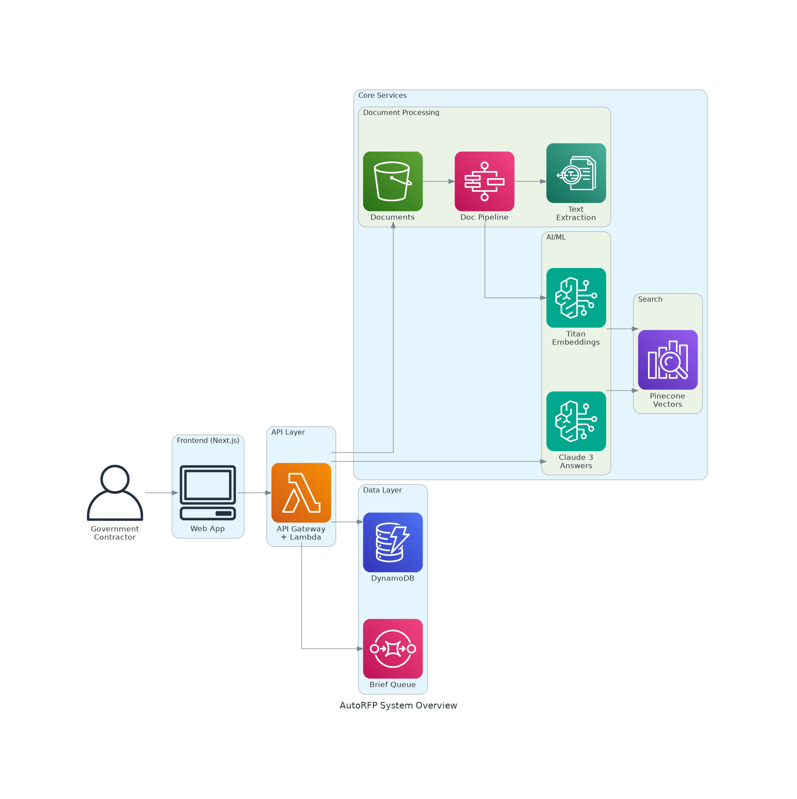
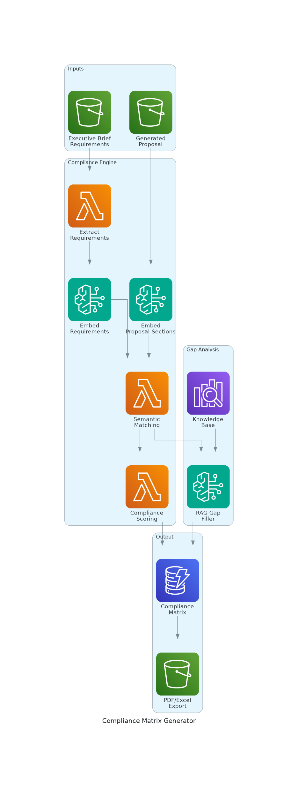
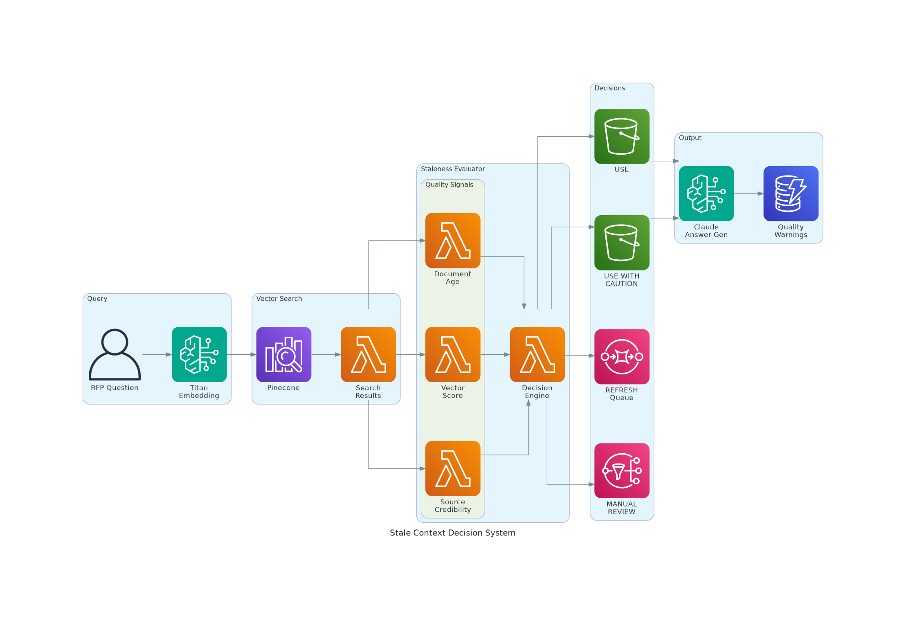
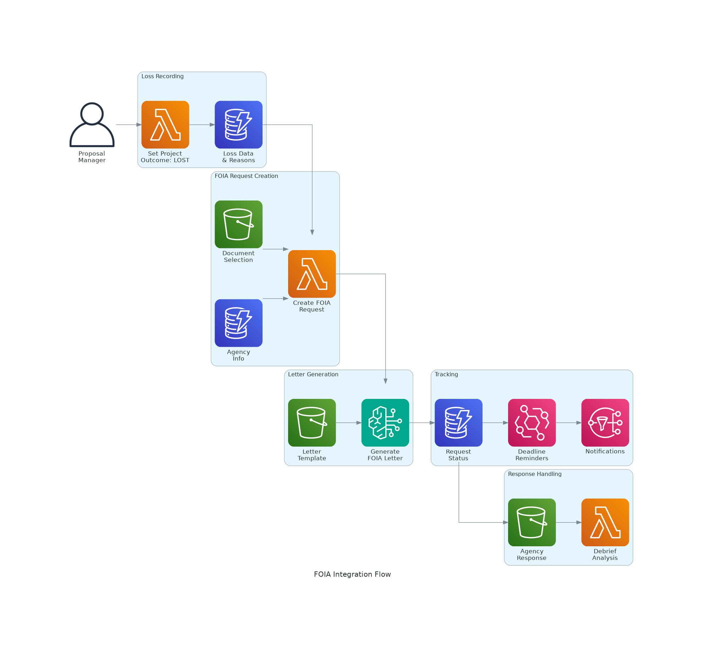
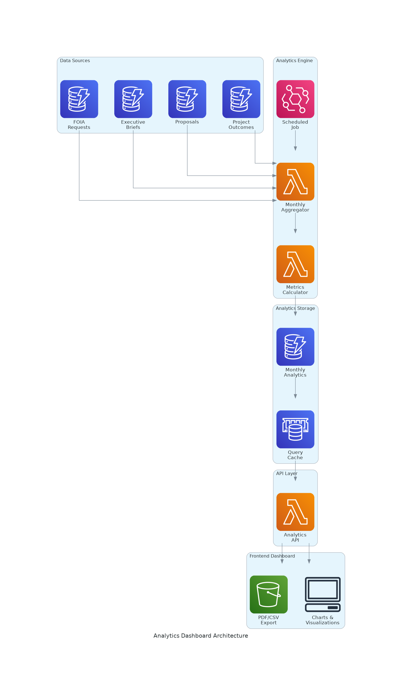
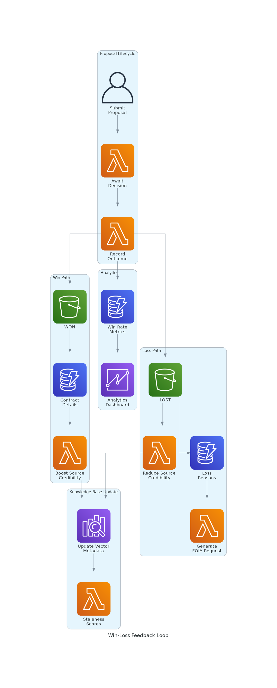

# AutoRFP Q1 2026 Feature Design Document

## Document Information

| Field | Value |
|-------|-------|
| **Version** | 1.0 |
| **Date** | February 4, 2026 |
| **Status** | Draft |
| **Authors** | Engineering Team |

---

## Executive Summary

This design document outlines four interconnected features that transform AutoRFP from a proposal generation tool into a comprehensive **proposal intelligence platform**. These features create a closed-loop system where every proposal outcome feeds back into improving future proposals.

### Features Covered

1. **Compliance Matrix Generator** - Automated requirement-to-response mapping
2. **Stale Context Decision System** - Knowledge base quality assurance
3. **FOIA Integration** - Post-loss intelligence gathering
4. **Analytics Dashboard** - Win/loss metrics and business intelligence

---

## Why We're Building This

### The Problem

Government contractors face a critical challenge: **they don't learn systematically from their wins and losses**. Current pain points include:

- **Compliance gaps discovered too late** - Requirements missed during proposal review
- **Outdated knowledge** - Past performance content becomes stale but keeps being used
- **Lost intelligence** - When proposals lose, the insights die with the opportunity
- **No metrics** - Teams can't identify patterns in their win/loss data

### Customer Feedback

> *"We lost a $4.2M contract because we missed a single compliance requirement buried on page 47. If we had a matrix showing us exactly what we addressed and what we didn't, we would have caught it."*
> — **Director of Capture, Defense Contractor (50+ employees)**

> *"Our knowledge base has documents from contracts we won 3 years ago. The technology has completely changed, but our AI keeps pulling those outdated references. We need a way to know when content is too old to trust."*
> — **Proposal Manager, IT Services Company**

> *"When we lose, we file a FOIA request manually. It takes weeks. By the time we get the debrief documents, the team has moved on to other opportunities. We never close the loop."*
> — **VP of Business Development, Systems Integrator**

> *"I have no idea what our actual win rate is. I can't tell my board whether we're getting better or worse at proposals. Everything is in spreadsheets that nobody updates."*
> — **CEO, Small Business GovCon**

### The Vision

AutoRFP will become the **single source of truth** for proposal intelligence:

```
┌─────────────────────────────────────────────────────────────────┐
│                    PROPOSAL INTELLIGENCE LOOP                    │
│                                                                  │
│   ┌──────────┐    ┌──────────┐    ┌──────────┐    ┌──────────┐ │
│   │ Generate │ -> │ Validate │ -> │ Submit   │ -> │ Record   │ │
│   │ Proposal │    │Compliance│    │ & Wait   │    │ Outcome  │ │
│   └──────────┘    └──────────┘    └──────────┘    └──────────┘ │
│        ^                                               │        │
│        │                                               v        │
│   ┌──────────┐    ┌──────────┐    ┌──────────┐    ┌──────────┐ │
│   │ Improve  │ <- │ Analyze  │ <- │ Gather   │ <- │  FOIA    │ │
│   │   KB     │    │ Metrics  │    │ Intel    │    │ Request  │ │
│   └──────────┘    └──────────┘    └──────────┘    └──────────┘ │
│                                                                  │
└─────────────────────────────────────────────────────────────────┘
```

---

## System Architecture Overview



The AutoRFP platform consists of:

- **Frontend**: Next.js 16 application with React 18
- **API Layer**: AWS Lambda functions behind API Gateway
- **AI/ML**: Amazon Bedrock (Claude 3 for generation, Titan for embeddings)
- **Vector Search**: Pinecone for semantic search
- **Data Layer**: DynamoDB (single-table design) + S3 for documents
- **Async Processing**: Step Functions for pipelines, SQS for queues

---

## Feature 1: Compliance Matrix Generator

### Purpose

Automatically map every RFP requirement to a specific response in the proposal, identifying gaps before submission.

### Customer Request

> *"I need to see a side-by-side view: here's what they asked for, here's exactly where we addressed it, and here's what we missed. Before we hit submit."*

### Architecture



### How It Works

1. **Extract Requirements**: Parse the Executive Brief's requirements section (already structured with `mustHave` flags)
2. **Embed Everything**: Create vector embeddings for both requirements and proposal sections
3. **Semantic Matching**: Find the proposal section that best addresses each requirement
4. **Score Compliance**: Calculate confidence scores based on semantic similarity
5. **Gap Analysis**: For low-confidence matches, use RAG to suggest content from knowledge base
6. **Generate Matrix**: Output structured compliance matrix with export options

### Data Model

```typescript
interface ComplianceMatrix {
  id: string
  projectId: string
  proposalId: string
  briefId: string

  mappings: RequirementMapping[]

  overallScore: number           // 0-100
  compliantCount: number
  partialCount: number
  nonCompliantCount: number

  criticalGaps: string[]         // mustHave requirements not met

  generatedAt: string
  exportedAt?: string
}

interface RequirementMapping {
  requirementId: string
  requirementText: string
  category: string
  mustHave: boolean

  responseSection: {
    sectionId: string
    sectionTitle: string
    relevantText: string         // Excerpt that addresses requirement
    pageReference?: string
  }

  status: 'COMPLIANT' | 'PARTIAL' | 'NON_COMPLIANT' | 'UNADDRESSED'
  confidence: number             // 0.0 - 1.0

  gapAnalysis?: string           // AI-suggested improvement
  suggestedContent?: string      // From knowledge base
}
```

### Completion State

| Criteria | Definition of Done |
|----------|-------------------|
| **Requirement Extraction** | 100% of requirements from brief parsed with mustHave flags |
| **Matching Accuracy** | >85% precision on requirement-to-response matching |
| **Gap Detection** | 100% of unaddressed mustHave requirements flagged |
| **Export** | PDF and Excel export with page references |
| **UI** | Interactive matrix with drill-down to source text |
| **Performance** | Matrix generated in <60 seconds for 100 requirements |

### Success Metrics

- **Primary**: Reduce compliance-related losses by 50%
- **Secondary**: <10% of matrices require manual correction
- **User Adoption**: 80% of proposals have compliance matrix generated before submission

---

## Feature 2: Stale Context Decision System

### Purpose

Automatically assess knowledge base content freshness and reliability to prevent outdated or low-quality context from degrading AI-generated answers.

### Customer Request

> *"We keep getting answers that reference a contract from 2019. That technology doesn't even exist anymore. How do I tell the AI to stop using old stuff?"*

### Architecture



### How It Works

1. **Query Vector Store**: When generating answers, retrieve candidate chunks from Pinecone
2. **Evaluate Quality Signals**: For each result, calculate:
   - **Document Age**: Days since content was indexed
   - **Vector Score**: Semantic similarity (0.0 - 1.0)
   - **Source Credibility**: Based on win/loss history of source document
3. **Make Decision**: Apply decision logic to each chunk
4. **Filter & Warn**: Use only appropriate chunks; add warnings for borderline cases

### Decision Matrix

| Freshness | Vector Score | Credibility | Decision |
|-----------|--------------|-------------|----------|
| FRESH (<30 days) | >0.7 | Any | **USE** |
| FRESH | 0.5-0.7 | >0.5 | **USE** |
| AGING (30-90 days) | >0.7 | >0.5 | **USE WITH CAUTION** |
| AGING | 0.5-0.7 | Any | **USE WITH CAUTION** |
| STALE (>90 days) | >0.8 | >0.7 | **USE WITH CAUTION** |
| STALE | <0.8 | Any | **REFRESH** |
| Any | <0.5 | Any | **SKIP** |
| Any | Any | <0.3 | **MANUAL REVIEW** |

### Data Model

```typescript
interface StalenessEvaluation {
  chunkId: string
  documentId: string

  qualitySignals: {
    documentAge: number          // Days since indexing
    freshness: 'FRESH' | 'AGING' | 'STALE'
    vectorScore: number          // 0.0 - 1.0
    sourceCredibility: number    // 0.0 - 1.0 (win rate of source doc)
    lastWinDate?: string         // Most recent win using this content
  }

  decision: 'USE' | 'USE_WITH_CAUTION' | 'REFRESH' | 'MANUAL_REVIEW' | 'SKIP'
  confidence: number
  reasoning: string
}

interface AnswerQualityMetadata {
  questionId: string
  answerId: string

  contextQuality: {
    totalChunksEvaluated: number
    chunksUsed: number
    averageFreshness: number
    averageCredibility: number
    staleChunksSkipped: number
  }

  warnings: string[]             // Shown to user
  suggestedRefreshes: string[]   // Documents to update
}
```

### Completion State

| Criteria | Definition of Done |
|----------|-------------------|
| **Metadata Tracking** | All indexed chunks have createdAt, documentId, sourceType |
| **Credibility Scores** | Win/loss outcomes update document credibility |
| **Decision Engine** | 100% of search results evaluated before use |
| **Warning Display** | Users see quality warnings on affected answers |
| **Refresh Queue** | Stale documents queued for re-indexing |
| **Dashboard** | KB health metrics visible (% fresh, % stale) |

### Success Metrics

- **Primary**: Zero answers generated from content >180 days old without warning
- **Secondary**: 20% reduction in answer confidence variance
- **User Trust**: 90% of users report higher confidence in AI answers

---

## Feature 3: FOIA Integration

### Purpose

Streamline the Freedom of Information Act request process to gather competitive intelligence after proposal losses.

### Customer Request

> *"Every time we lose, I have to manually draft a FOIA letter, look up the agency's FOIA office, and track the 20-business-day deadline in my calendar. Then I forget to follow up."*

### Architecture



### Current State (Already Built)

The FOIA integration is **substantially complete**:

**Backend (Complete):**
- 4 Lambda handlers: create, get, update, generate-letter
- Full Zod schema with 13 document types
- 20-business-day deadline calculation
- Agency information storage

**Frontend (Complete):**
- CreateFOIARequestDialog with document selection
- FOIARequestCard with status tracking
- Letter preview and generation
- Deadline warnings

**What's Missing:**
- Automated deadline reminders (EventBridge scheduled)
- Response upload and tracking
- Integration with debrief analysis
- FOIA success rate metrics

### Supported Document Types

| Document Type | Description |
|---------------|-------------|
| SSEB_REPORT | Source Selection Evaluation Board Report |
| SSDD | Source Selection Decision Document |
| TECHNICAL_EVAL | Technical Evaluation Scores |
| PRICE_EVAL | Price/Cost Evaluation |
| PAST_PERF_EVAL | Past Performance Evaluation |
| ORAL_PRESENTATION | Oral Presentation Scores |
| DISCUSSIONS | Discussion/Negotiation Records |
| PROPOSAL_ABSTRACT | Winning Proposal Abstract |
| DEBRIEFING_NOTES | Debriefing Documentation |
| AWARD_DETERMINATION | Award Determination Memo |
| COMPETITIVE_RANGE | Competitive Range Determination |
| BEST_VALUE_ANALYSIS | Best Value Tradeoff Analysis |
| OTHER | Other Releasable Documents |

### Data Model (Existing)

```typescript
interface FOIARequest {
  id: string
  projectId: string
  organizationId: string

  status: 'DRAFT' | 'SUBMITTED' | 'ACKNOWLEDGED' | 'IN_PROCESSING' |
          'RESPONSE_RECEIVED' | 'APPEALED' | 'CLOSED'

  agency: {
    name: string
    foiaEmail: string
    foiaAddress?: string
  }

  contractInfo: {
    solicitationNumber: string
    contractNumber?: string
    contractTitle: string
  }

  requestedDocuments: DocumentType[]

  requester: {
    name: string
    email: string
    phone?: string
    address?: string
  }

  responseDeadline: string       // Calculated: submit + 20 business days
  submittedAt?: string
  responseReceivedAt?: string

  notes?: string
  generatedLetter?: string
}
```

### Completion State

| Criteria | Current | Target |
|----------|---------|--------|
| **Request Creation** | ✅ Complete | - |
| **Letter Generation** | ✅ Complete | - |
| **Status Tracking** | ✅ Complete | - |
| **Deadline Calculation** | ✅ Complete | - |
| **Automated Reminders** | ❌ Not Built | EventBridge triggers at 5, 10, 15, 20 days |
| **Response Upload** | ❌ Not Built | S3 upload + metadata extraction |
| **Debrief Analysis** | ❌ Not Built | AI analysis of received documents |
| **Success Metrics** | ❌ Not Built | Track response rates by agency |

### Success Metrics

- **Primary**: 100% of lost proposals have FOIA request generated within 5 days
- **Secondary**: 80% response rate from agencies within deadline
- **Intelligence**: Debrief insights fed back into knowledge base

---

## Feature 4: Analytics Dashboard

### Purpose

Provide actionable business intelligence on proposal performance, win rates, and loss patterns.

### Customer Request

> *"I need to walk into my board meeting and say: 'Our win rate improved from 23% to 31% this quarter. Here's why.' Right now I have no idea what our numbers actually are."*

### Architecture



### Current State

**Built:**
- Complete Zod schemas for MonthlyAnalytics, AnalyticsSummary
- Helper functions for calculations (win rate, submission rate)
- Project outcome tracking (WON, LOST, NO_BID, WITHDRAWN, PENDING)
- Loss reason categorization (12 reason types)

**Not Built:**
- Lambda handlers for analytics API
- Scheduled aggregation job
- Frontend dashboard
- Export functionality

### Key Metrics

| Metric | Calculation | Purpose |
|--------|-------------|---------|
| **Win Rate** | won / (won + lost) × 100 | Primary success indicator |
| **Submission Rate** | submitted / total × 100 | Pipeline conversion |
| **Pipeline Value** | Sum of all active opportunities | Revenue forecast |
| **Average Contract Value** | totalWonValue / projectsWon | Deal size tracking |
| **Time to Decision** | Average days from submit to outcome | Process efficiency |
| **Top Loss Reason** | Most frequent loss reason | Improvement focus |
| **FOIA Response Rate** | responses / requests × 100 | Intelligence gathering |

### Data Model (Existing Schema)

```typescript
interface MonthlyAnalytics {
  organizationId: string
  month: string                  // YYYY-MM format

  // Volume Metrics
  totalProjects: number
  projectsSubmitted: number
  projectsWon: number
  projectsLost: number
  projectsNoBid: number
  projectsWithdrawn: number
  projectsPending: number

  // Financial Metrics
  totalPipelineValue: number
  totalWonValue: number
  totalLostValue: number
  averageContractValue: number

  // Time Metrics
  averageTimeToSubmit: number    // Days
  averageTimeToDecision: number  // Days

  // Loss Analysis
  lossReasonBreakdown: Record<LossReason, number>

  // Computed
  winRate: number                // Percentage
  submissionRate: number         // Percentage

  // FOIA Metrics
  foiaRequestsGenerated: number
  foiaResponsesReceived: number

  // Metadata
  calculatedAt: string
  projectIds: string[]
}

interface AnalyticsSummary extends MonthlyAnalytics {
  startMonth: string
  endMonth: string
  monthCount: number
  topLossReason?: LossReason
}
```

### Dashboard Wireframe

```
┌─────────────────────────────────────────────────────────────────┐
│  Analytics Dashboard                    [Date Range ▼] [Export] │
├─────────────────────────────────────────────────────────────────┤
│                                                                  │
│  ┌──────────────┐ ┌──────────────┐ ┌──────────────┐ ┌─────────┐ │
│  │  WIN RATE    │ │  PIPELINE    │ │   WON        │ │ PENDING │ │
│  │    31%       │ │   $24.5M     │ │   $8.2M      │ │   12    │ │
│  │   ↑ 8%       │ │   ↑ 12%      │ │   ↑ 23%      │ │         │ │
│  └──────────────┘ └──────────────┘ └──────────────┘ └─────────┘ │
│                                                                  │
│  ┌─────────────────────────────┐ ┌─────────────────────────────┐│
│  │     Win Rate Trend          │ │    Loss Reasons             ││
│  │                             │ │                             ││
│  │    ▲                        │ │  Price Too High    ████ 35% ││
│  │   ╱ ╲      ╱╲               │ │  Technical Score   ███  22% ││
│  │  ╱   ╲    ╱  ╲   ╱          │ │  Past Performance  ██   18% ││
│  │ ╱     ╲  ╱    ╲ ╱           │ │  Incumbent Adv.    ██   15% ││
│  │╱       ╲╱      ╲            │ │  Other             █    10% ││
│  │ J F M A M J J A S O N D    │ │                             ││
│  └─────────────────────────────┘ └─────────────────────────────┘│
│                                                                  │
│  ┌─────────────────────────────────────────────────────────────┐│
│  │  Recent Outcomes                                             ││
│  │  ─────────────────────────────────────────────────────────  ││
│  │  ✓ DoD Cloud Migration      WON    $2.4M   Feb 1, 2026     ││
│  │  ✗ VA Health Portal         LOST   $1.8M   Jan 28, 2026    ││
│  │  ✓ DHS Security Audit       WON    $890K   Jan 15, 2026    ││
│  └─────────────────────────────────────────────────────────────┘│
└─────────────────────────────────────────────────────────────────┘
```

### Completion State

| Criteria | Current | Target |
|----------|---------|--------|
| **Schema** | ✅ Complete | - |
| **Outcome Recording** | ✅ Complete | - |
| **Loss Reasons** | ✅ Complete | - |
| **Aggregation Lambda** | ❌ Not Built | Monthly scheduled job |
| **Query API** | ❌ Not Built | Date range queries |
| **Dashboard UI** | ❌ Not Built | Charts with Recharts/Victory |
| **Export** | ❌ Not Built | PDF and CSV export |
| **Caching** | ❌ Not Built | ElastiCache for fast queries |

### Success Metrics

- **Primary**: 100% of organizations have real-time win rate visibility
- **Secondary**: Board-ready PDF export used by 50% of users quarterly
- **Insight**: Users identify top loss reason and take corrective action

---

## Feature Integration: The Feedback Loop



### How Features Connect

1. **Proposal Generated** → Compliance Matrix validates completeness
2. **Proposal Submitted** → Analytics tracks submission metrics
3. **Outcome Recorded** →
   - WIN: Boost source document credibility in Stale Context system
   - LOSS: Trigger FOIA request generation, reduce source credibility
4. **FOIA Response Received** → Debrief analyzed, insights added to KB
5. **Knowledge Base Updated** → Better context for next proposal
6. **Next Proposal** → Stale Context uses updated credibility scores

### Data Flow

```
Proposal Submit
     │
     v
Record Outcome ──────────────────────────────────┐
     │                                           │
     ├── WIN ─────┐                              │
     │            v                              │
     │     Update Credibility (+)                │
     │            │                              │
     │            v                              │
     │     Add to "Winning" KB                   │
     │                                           │
     └── LOSS ────┐                              │
                  v                              │
           Record Loss Reason                    │
                  │                              │
                  v                              │
           Generate FOIA Request                 │
                  │                              │
                  v                              │
           Await Response ──────────────────────>│
                  │                              │
                  v                              │
           Analyze Debrief                       │
                  │                              │
                  v                              │
           Update Credibility (-)                │
                  │                              │
                  v                              │
           Extract Lessons → Add to KB           │
                                                 │
                  ┌──────────────────────────────┘
                  v
           Analytics Dashboard
                  │
                  v
           Identify Patterns
                  │
                  v
           Improve Process
```

---

## Appendix A: Loss Reason Categories

| Code | Label | Description |
|------|-------|-------------|
| PRICE_TOO_HIGH | Price Too High | Our price was not competitive |
| TECHNICAL_SCORE | Technical Score | Technical approach rated lower |
| PAST_PERFORMANCE | Past Performance | Insufficient relevant past performance |
| INCUMBENT_ADVANTAGE | Incumbent Advantage | Incumbent contractor retained |
| SMALL_BUSINESS_SETASIDE | Small Business Set-Aside | Lost to small business preference |
| COMPLIANCE_ISSUE | Compliance Issue | Proposal did not meet requirements |
| LATE_SUBMISSION | Late Submission | Proposal submitted after deadline |
| CANCELLED | Cancelled | Procurement was cancelled |
| PROTEST | Protest | Award protested (pending resolution) |
| SCOPE_CHANGE | Scope Change | Requirements changed significantly |
| RELATIONSHIP | Relationship | Competitor had stronger relationships |
| UNKNOWN | Unknown | Reason not determined |

---

## Appendix B: API Endpoints (Planned)

### Compliance Matrix
- `POST /compliance/generate-matrix` - Generate compliance matrix
- `GET /compliance/get-matrix/{projectId}` - Retrieve matrix
- `POST /compliance/export-matrix` - Export to PDF/Excel

### Analytics
- `GET /analytics/monthly` - Get monthly analytics
- `GET /analytics/summary` - Get aggregated summary
- `POST /analytics/export` - Export report
- `GET /analytics/global` - Cross-org analytics (admin)

### FOIA (Existing + New)
- `POST /foia/schedule-reminder` - Set up deadline reminders
- `POST /foia/upload-response` - Upload agency response
- `POST /foia/analyze-debrief` - AI analysis of response

---

## Appendix C: Diagram Files

All architecture diagrams are located in `/docs/generated-diagrams/`:

1. `01-system-overview.png` - Overall system architecture
2. `02-compliance-matrix.png` - Compliance Matrix Generator flow
3. `03-stale-context.png` - Stale Context Decision System
4. `04-analytics-dashboard.png` - Analytics Dashboard architecture
5. `05-foia-integration.png` - FOIA Integration flow
6. `06-feedback-loop.png` - Win/Loss Feedback Loop

---

## Document History

| Version | Date | Author | Changes |
|---------|------|--------|---------|
| 1.0 | Feb 4, 2026 | Engineering | Initial draft |
